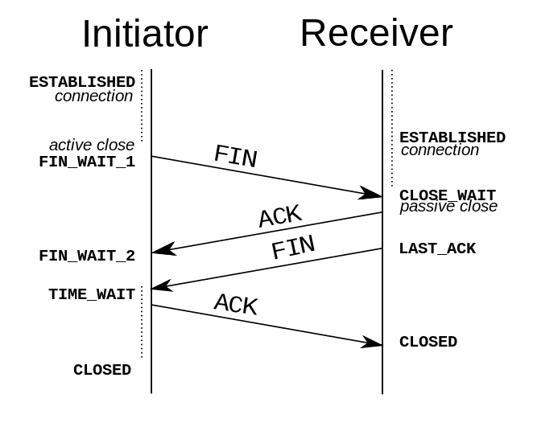

## 事件机制

### 事件触发三阶段

- window 往事件触发处传播，遇到注册的捕获事件会触发
- 传播到事件触发处时触发注册的事件
- 从事件触发处往 window 传播，遇到注册的冒泡事件会触发

### 注册事件

`addEventListener` 注册事件，该函数的第三个参数可以是布尔值，也可以是对象。对于布尔值 useCapture 参数来说，该参数默认值为 false ，useCapture 决定了注册的事件是捕获事件还是冒泡事件

`stopPropagation` 是用来阻止事件冒泡的

```js
node.addEventListener(
  "click",
  (event) => {
    event.stopImmediatePropagation()
    console.log("冒泡")
  },
  false
)
// 点击 node 只会执行上面的函数，该函数不会执行
node.addEventListener(
  "click",
  (event) => {
    console.log("捕获 ")
  },
  true
)
```

### 事件代理

如果一个节点中的子节点是动态生成的，那么子节点需要注册事件的话应该注册在父节点上

```html
<ul id="ul">
  <li>1</li>
  <li>2</li>
  <li>3</li>
  <li>4</li>
  <li>5</li>
</ul>
<script>
  let ul = document.querySelector("#ul")
  ul.addEventListener("click", (event) => {
    console.log(event.target)
  })
</script>
```

## 跨域

- 因为浏览器出于安全考虑，有`同源策略`
  - 如果`协议、域名或者端口`有一个不同就是跨域
- 主要是用来防止 CSRF 攻击的。简单点说，CSRF 攻击是利用用户的登录态发起恶意请求

### jsonp

JSONP 的原理很简单，就是利用 `<script> 标签没有跨域限制的漏洞。通过 <script> 标签指向一个需要访问的地址并提供一个回调函数来接收数据`

```js
<script src="http://domain/api?param1=a&param2=b&callback=jsonp"></script>
<script>
    function jsonp(data) {
    	console.log(data)
	}
</script>
```

### CORS

- CORS 需要浏览器和后端同时支持。IE 8 和 9 需要通过 XDomainRequest 来实现
- 服务端设置 `Access-Control-Allow-Origin` 就可以开启 CORS

### document.domain

- 该方式只能用于`二级域名相同的情况下`，比如 a.test.com 和 b.test.com 适用于该方式。
- 只需要给页面添加 `document.domain = 'test.com'` 表示二级域名都相同就可以实现跨域

### postMessage

- 方式通常用于获取嵌入页面中的第三方页面数据。一个页面发送消息，另一个页面判断来源并接收消息

```js
// 发送消息端
window.parent.postMessage("message", "http://test.com")
// 接收消息端
var mc = new MessageChannel()
mc.addEventListener("message", (event) => {
  var origin = event.origin || event.originalEvent.origin
  if (origin === "http://test.com") {
    console.log("验证通过")
  }
})
```

## Service Worker

Service Worker 是运行在浏览器背后的独立线程，一般可以用来实现缓存功能。使用 Service Worker 的话，传输协议必须为 HTTPS。因为 Service Worker 中涉及到请求拦截，所以必须使用 HTTPS 协议来保障安全。

Service Worker 实现缓存功能一般分为三个步骤：首先需要先注册 Service Worker，然后监听到 install 事件以后就可以缓存需要的文件，那么在下次用户访问的时候就可以通过拦截请求的方式查询是否存在缓存，存在缓存的话就可以直接读取缓存文件，否则就去请求数据

```js
// index.js
if (navigator.serviceWorker) {
  navigator.serviceWorker
    .register("sw.js")
    .then(function (registration) {
      console.log("service worker 注册成功")
    })
    .catch(function (err) {
      console.log("servcie worker 注册失败")
    })
}
// sw.js
// 监听 `install` 事件，回调中缓存所需文件
self.addEventListener("install", (e) => {
  e.waitUntil(
    caches.open("my-cache").then(function (cache) {
      return cache.addAll(["./index.html", "./index.js"])
    })
  )
})

// 拦截所有请求事件
// 如果缓存中已经有请求的数据就直接用缓存，否则去请求数据
self.addEventListener("fetch", (e) => {
  e.respondWith(
    caches.match(e.request).then(function (response) {
      if (response) {
        return response
      }
      console.log("fetch source")
    })
  )
})
```

## 浏览器缓存机制

### 缓存位置

从缓存位置上来说分为四种，并且各自有优先级，当依次查找缓存且都没有命中的时候，才会去请求网络

- `Service Worker`
  - 可以自由控制缓存哪些文件, 缓存是持续性的
- `Memory Cache` 也就是内存中的缓存
  - 对于大文件来说, 大概率不存储在内存中的, 反之优先
- `Disk Cache` 存储在硬盘中的缓存
  - 比之 `Memory Cache` 胜在容量和存储时效上
  - 并且既使在跨站点的情况下, 相同地址的资源一旦被硬盘缓存下来, 就不会再次去请求数据
- `Push Cache`
  - 是 `HTTP/2` 中的内容, 以上三种缓存都没命中, 才会使用, 缓存时间很短暂, 只在会话中存在
- 网络请求

### 缓存策略

浏览器缓存策略分为: `强缓存和协商缓存`, 并且缓存策略都是通过设置 `HTTP Header`来实现的

1. 强缓存

通过设置两种: HTTP Header 实现 `Expires 和 Cache-Control`. 强缓存表示在缓存期间不需要请求, `status code 200`

- `Expires` 过期时间: `Expires 是 HTTP/1` 的产物, 表示资源会在什么时候后过期, 需要再次请求. 并且 Expires 受限于白底事件, 如果修改了本地时间, 可能会造成缓存时效
- `Cache-Control: max-age=30` 也是出现于 `HTTP/1.1`, 优先级高于 Expires, 该属性值表示资源会在 30s 后过期, 需要再次请求, 可以在请求头或者响应头中设置，并且可以组合使用多种指令

```http
Expires: Wed, 22 Oct 2018 GMT
Cache-control: max-age=30
Cache-control: no-cache
```

2. 协商缓存

如果缓存过期了，就需要发起请求验证资源是否有更新。协商缓存可以通过设置两种 `HTTP Header 实现：Last-Modified 和 ETag`

- `Last-Modified 和 If-Modified-Since:`
  - Last-Modified 表示本地文件最后修改日期，
  - If-Modified-Since 会将 Last-Modified 的值发送给服务器，询问服务器在该日期后资源是否有更新，有更新的话就会将新的资源发送回来，否则返回 304 状态码。
- `ETag 和 If-None-Match`
  - ETag 类似于文件指纹，
  - If-None-Match 会将当前 ETag 发送给服务器，询问该资源 ETag 是否变动，有变动的话就将新的资源发送回来。并且 ETag 优先级比 Last-Modified 高

## 浏览器渲染机制

- 执行 JS 有一个 JS 引擎, 那么执行渲染也有一个`渲染引擎`
- DOM: `Document Object Model` 浏览器将 HTML 解析成树形的数据结构，简称 DOM
- CSSOM: `CSS Object Model` 浏览器将 CSS 代码解析成树形的数据结构
- DOM 和 CSSOM 都是以 `Bytes → characters → tokens → nodes → object model`.这样的方式生成最终的数据
- Render Tree: DOM 和 CSSOM 合并后生成 Render Tree


1. 用户输入一个 `URL`, 浏览器会发送一个请求, 请求 `URL` 的资源
2. 浏览器的 `HTML解析器` 会将这个文件解析, 构建一颗 `DOM` 树, (生成 DOM 的最开始阶段(Bytes -> characters)后, 并行发起 `css 图片 js` 的请求)
   1. 注意: 发起 js 文件的下载 request 并不需要 DOM 处理到那个 script 节点
3. 在构建 DOM 树的时候,遇到 js 和 css 元素, HTML 解析器就将控制权转让给`JS解析器`或者`CSS解析器`, 开始构建 `CSSOM`
4. DOM 树构建完之后, 浏览器会把 DOM 树中的一些不可见元素去掉, 与 CSSOM 合成一颗 `render tree`
5. `Layout`: 有了 `Render Tree`, 浏览器知道网页中有哪些节点, 各个节点的 CSS 定义以及从属关系, 下一步操作就是 `Layout`, 计算出每个节点在屏幕中的位置
6. `Painting`: 浏览器已经知道了那些节点要显示, 每个节点的 CSS 属性是什么, 每个节点在屏幕里的位置, 按照算出来的规则, 把内容画到屏幕上

:::tip

上面几个步骤因为 `DOM CSSOM Render Tree` 都可能在第一次 `Painting` 后被更新多次, 比如 JS 修改了 DOM 或者 CSS 属性. layout 和 Painting 也会重复执行, 除了`DOM、CSSOM`更新的原因外，图片下载完成后也需要调用`Layout 和 Painting`来更新网页
:::

为什么操作 DOM 慢?

- 因为 DOM 是属于渲染引擎中的东西，而 JS 又是 JS 引擎中的东西。当我们通过 JS 操作 DOM 的时候，其实这个操作涉及到了两个线程之间的通信

## Repaint Reflow

`重绘（repaints）`是一个元素外观的改变所触发的浏览器行为，例如改变 vidibility、outline、背景色等属性。浏览器会根据元素的新属性重新绘制，使元素呈现新的外观。重绘不会带来重新布局，并不一定伴随回流。

`回流（reflow）`布局或者几何属性需要改变就称为回流

引起重绘和回流的一些操作

- 当你增加、删除、修改 DOM 结点时，会导致 Reflow 或 Repaint
- 当你移动 DOM 的位置，或是搞个动画的时候
- 当你修改 CSS 样式的时候
- 当你 Resize 窗口的时候（移动端没有这个问题），或是滚动的时候。
- 当你修改网页的默认字体时
  - 注：`display:none 会触发 reflow，而 visibility:hidden 只会触发 repaint`，因为没有发现位置变化。

减少重绘和回流

- 使用 `transform 替代 top`
- 使用 `visibility 替换 display: none` ，因为前者只会引起重绘，后者会引发回流
- 不要把节点的属性值放在一个循环里当成循环里的变量
- 不要使用 `table 布局`，可能很小的一个小改动会造成整个 table 的重新布局
- 动画实现的速度的选择，动画速度越快，回流次数越多，也可以选择使用 requestAnimationFrame
- CSS 选择符从右往左匹配查找，避免节点层级过多

## 安全防范

### XSS

攻击者想尽一切办法将可以执行的代码注入到网页中, 分为两类：`持久型和非持久型。`

`持久型`也就是攻击的代码被服务端写入进数据库中，这种攻击危害性很大，因为如果网站访问量很大的话，就会导致大量正常访问页面的用户都受到攻击。对于评论功能来说，就得防范持久型 XSS 攻击

`非持久性`: 一般通过修改 URL 参数的方式加入攻击代码，诱导用户访问链接从而进行攻击

- 防御 1: `转义字符`
- 防御 2: CSP 本质上就是建立白名单，开发者明确告诉浏览器哪些外部资源可以加载和执行
  - 设置 HTTP Header 中的 Content-Security-Policy
  - 设置 meta 标签的方式 `<meta http-equiv="Content-Security-Policy">`

```http
# 只允许加载本站资源
Content-Security-Policy: default-src ‘self’

# 只允许加载 HTTPS 协议图片
Content-Security-Policy: img-src https://*

# 允许加载任何来源框架
Content-Security-Policy: child-src 'none'
```

### CSRF

跨站请求伪造。原理就是攻击者构造出一个后端请求地址，诱导用户点击或者通过某些途径自动发起请求。如果用户是在登录状态下的话，后端就以为是用户在操作，从而进行相应的逻辑

- Get 请求不对数据进行修改
- 不让第三方网站访问到用户 Cookie
- 阻止第三方网站请求接口
- 请求时附带验证信息，比如验证码或者 Token

### 点击劫持

是一种视觉欺骗的攻击手段。攻击者将需要攻击的网站通过 iframe 嵌套的方式嵌入自己的网页中，并将 iframe 设置为透明，在页面中透出一个按钮诱导用户点击

- `X-FRAME-OPTIONS` 是一个 HTTP 响应头，在现代浏览器有一个很好的支持。这个 HTTP 响应头 就是为了防御用 iframe 嵌套的点击劫持攻击。
- JS 防御

```js
<head>
  <style id="click-jack">
    html {
      display: none !important;
    }
  </style>
</head>
<body>
  <script>
    if (self == top) {
      var style = document.getElementById('click-jack')
      document.body.removeChild(style)
    } else {
      top.location = self.location
    }
  </script>
</body>
```

### 中间人攻击

是攻击方同时与服务端和客户端建立起了连接，并让对方认为连接是安全的，但是实际上整个通信过程都被攻击者控制了。攻击者不仅能获得双方的通信信息，还能修改通信信息

- 不建议使用公共的 Wi-Fi，因为很可能就会发生中间人攻击的情况
- 只需要增加一个安全通道来传输信息。HTTPS 就可以用来防御中间人攻

## 输入 URL 页面渲染的整个流程

1. 输入 URL, 会进行 URL 解析, DNS 查询, DNS 的作用就是通过域名查询到具体的 IP
   - 操作系统会首先在本地缓存中查询 IP
   - 没有的话会去系统配置的 DNS 服务器中查询
   - 如果这时候还没得话，会直接去 DNS 根服务器查询，这一步查询会找出负责 com 这个一级域名的服务器
   - 然后去该服务器查询 google 这个二级域名
   - 接下来三级域名的查询其实是我们配置的，你可以给 www 这个域名配置一个 IP，然后还可以给别的三级域名配置一个 IP
2. TCP 握手，应用层会下发数据给传输层，这里 TCP 协议会指明两端的端口号，然后下发给网络层。网络层中的 IP 协议会确定 IP 地址，并且指示了数据传输中如何跳转路由器。然后包会再被封装到数据链路层的数据帧结构中，最后就是物理层面的传输了。

3. 浏览器会判断状态码是什么，如果是 200 那就继续解析，如果 400 或 500 的话就会报错，如果 300 的话会进行重定向，这里会有个重定向计数器，避免过多次的重定向，超过次数也会报错

4. 浏览器开始解析文件，如果是 gzip 格式的话会先解压一下，然后通过文件的编码格式知道该如何去解码文件。

5. 文件解码成功后会正式开始渲染流程，先会根据 HTML 构建 DOM 树，有 CSS 的话会去构建 CSSOM 树。如果遇到 script 标签的话，会判断是否存在 async 或者 defer ，前者会并行进行下载并执行 JS，后者会先下载文件，然后等待 HTML 解析完成后顺序执行。

6. CSSOM 树和 DOM 树构建完成后会开始生成 Render 树，这一步就是确定页面元素的布局、样式等等诸多方面的东西

7. Render 树的过程中，浏览器就开始调用 GPU 绘制，合成图层，将内容显示在屏幕上了

## 性能优化琐碎事

### 图片优化

1. 计算图片大小
   - 减少像素点
   - 减少每个像素点能够显示的颜色
2. 图片加载优化
   - 不用图片, 有些可以使用 css 代替
   - 对于移动端来说, 使用 CDN 加载, 计算适配屏幕的宽度
   - 小图使用 base64 格式
   - 将多个图标文件正和岛一张图片中(雪碧图)
   - 能够显示 webp 格式的浏览器使用 webp 格式; 小图使用 png, 照片用 jpeg

### DNS 预解析 & 预加载 & 预渲染

```html
<!-- DNS 解析也是需要时间的，可以通过预解析的方式来预先获得域名所对应的 IP -->
<link rel="dns-prefetch" href="//yuchengkai.cn" />

<!-- 有些资源不需要马上用到，但是希望尽早获取，这时候就可以使用预加载。 -->
<!-- 预加载其实是声明式的 fetch ，强制浏览器请求资源，并且不会阻塞 onload 事件，可以使用以下代码开启预加载 -->
<!-- 预加载可以一定程度上降低首屏的加载时间，因为可以将一些不影响首屏但重要的文件延后加载，唯一缺点就是兼容性不好。 -->
<link rel="preload" href="http://example.com" />

<!-- 通过预渲染将下载的文件预先在后台渲染，可以使用以下代码开启预渲染 -->
<!-- 预渲染虽然可以提高页面的加载速度，但是要确保该页面大概率会被用户在之后打开，否则就是白白浪费资源去渲染。 -->
<link rel="prerender" href="http://example.com" />
```

### 懒执行 & 懒加载 & CDN

1. 懒执行就是将某些逻辑延迟到使用时再计算。该技术可以用于首屏优化，对于某些耗时逻辑并不需要在首屏就使用的，就可以使用懒执行。懒执行需要唤醒，一般可以通过定时器或者事件的调用来唤醒。
2. 懒加载就是将不关键的资源延后加载。
   - 懒加载的原理就是只加载自定义区域（通常是可视区域，但也可以是即将进入可视区域）内需要加载的东西。对于图片来说，先设置图片标签的 src 属性为一张占位图，将真实的图片资源放入一个自定义属性中，当进入自定义区域时，就将自定义属性替换为 src 属性，这样图片就会去下载资源，实现了图片懒加载。
   - 懒加载不仅可以用于图片，也可以使用在别的资源上。比如进入可视区域才开始播放视频等等。
3. CDN 的原理是尽可能的在各个地方分布机房缓存数据，这样即使我们的根服务器远在国外，在国内的用户也可以通过国内的机房迅速加载资源。
   - 我们可以将静态资源尽量使用 CDN 加载，由于浏览器对于单个域名有并发请求上限，可以考虑使用多个 CDN 域名。并且对于 CDN 加载静态资源需要注意 CDN 域名要与主站不同，否则每次请求都会带上主站的 Cookie，平白消耗流量。

## 监控

前端监控一般分为三种，分别为页面埋点、性能监控以及异常监控。

### 页面埋点

页面埋点应该是大家最常写的监控了，一般起码会监控以下几个数据：

- PV / UV
- 停留时长
- 流量来源
- 用户交互

手写埋点，可以自主选择需要监控的数据然后在相应的地方写入代码。这种方式的灵活性很大，但是唯一的缺点就是工作量较大，每个需要监控的地方都得插入代码。

另一种无埋点的方式基本不需要开发者手写埋点了，而是统计所有的事件并且定时上报。这种方式虽然没有前一种方式繁琐了，但是因为统计的是所有事件，所以还需要后期过滤出需要的数据。

### 性能监控

对于性能监控来说，我们可以直接使用浏览器自带的 Performance API 来实现这个功能

对于性能监控来说，其实我们只需要调用 `performance.getEntriesByType('navigation')` 这行代码就行了

### 异常监控

对于异常监控来说，以下两种监控是必不可少的，分别是代码报错以及接口异常上报。

对于代码运行错误，通常的办法是使用 `window.onerror` 拦截报错。该方法能拦截到大部分的详细报错信息，但是也有例外

- 对于跨域的代码运行错误会显示 Script error. 对于这种情况我们需要给 script 标签添加 crossorigin 属性
- 对于某些浏览器可能不会显示调用栈信息，这种情况可以通过 arguments.callee.caller 来做栈递归

对于异步代码来说，可以使用 catch 的方式捕获错误。比如 Promise 可以直接使用 catch 函数，async await 可以使用 try catch。

但是要注意线上运行的代码都是压缩过的，需要在打包时生成 sourceMap 文件便于 debug。

对于捕获的错误需要上传给服务器，通常可以通过 img 标签的 src 发起一个请求。

另外接口异常就相对来说简单了，可以列举出出错的状态码。一旦出现此类的状态码就可以立即上报出错。接口异常上报可以让开发人员迅速知道有哪些接口出现了大面积的报错，以便迅速修复问题。

## UDP

> 不需要在正式传递数据之前先连接起双方。然后 UDP 协议只是数据报文的搬运工，不保证有序且不丢失的传递到对端，并且 UDP 协议也没有任何控制流量的算法，总的来说 UDP 相较于 TCP 更加的轻便

1. UDP 协议是面向无连接的
   - 不需要和 TCP 一样在发送数据前进行三次握手建立连接的，想发数据就可以开始发送了
   - 在发送端，应用层将数据传递给传输层的 UDP 协议，UDP 只会给数据增加一个 UDP 头标识下是 UDP 协议，然后就传递给网络层了
   - 在接收端，网络层将数据传递给传输层，UDP 只去除 IP 报文头就传递给应用层，不会任何拼接操作
2. 不可靠性
   - 不可靠性体现在无连接上，通信都不需要建立连接，想发就发，这样的情况肯定不可靠
3. 高效
   - 正是因为它不是那么的可靠，所以也就没有 TCP 那么复杂了，需要保证数据不丢失且有序到达
   - UDP 的头部开销小，只有八字节，相比 TCP 的至少二十字节要少得多，在传输数据报文时是很高效的。
     - 头部包含: 两个十六位的端口号, 分别是源端口(可选字段)和目标端口
     - 整个数据报文的长度
     - 整个数据报文的检验和(IPv4 可选字段), 该字段用于发现头部信息和数据中的错误
4. 传输方式
   - UDP 不止支持一对一的传输方式，同样支持一对多，多对多，多对一的方式，也就是说 UDP 提供了单播，多播，广播的功能。

UDP 相比 TCP 简单的多，不需要建立连接，不需要验证数据报文，不需要流量控制，只会把想发的数据报文一股脑的丢给对端

虽然 UDP 并没有 TCP 传输来的准确，但是也能在很多实时性要求高的地方有所作为

## TCP

> TCP 基本是和 UDP 反着来，建立连接断开连接都需要先需要进行握手。在传输数据的过程中，通过各种算法保证数据的可靠性，当然带来的问题就是相比 UDP 来说不那么的高效

### 头部


对于 TCP 头部来说, 以下几个字段是很重要的

- Sequence number, 这个序号保证了 TCP 传输的报文都是有序的, 对端可以通过序号顺序的拼接报文
- Acknowledge number, 这个序号表示数据接受期望接收的下一个字节的编号是多少, 同时也表示上一个序号的数据已经收到
- Window Size, 窗口大小, 表示还能接收多少字节的数据, 用于流量控制
- 标识符
  - URG=1: 该字段表示本数据报的数据部分包含紧急信息, 是一个高优先级数据报文, 此时紧急指针有效. 紧急数据一定位于当前数据包数据部分的最前面, 紧急指针标明了紧急数据的尾部
  - ACK=1: 表示确认号字段有效. 此外, TCP 还规定在连接建立后传送的所有报文段都必须把 ACK 置为 1
  - PSH=1：该字段为一表示接收端应该立即将数据 push 给应用层，而不是等到缓冲区满后再提交。
  - RST=1: 该字段表示当前 TCP 连接出现严重问题, 可能需要重新建立 TCP 连接, 也可以用于拒绝非法的报文段和拒绝连接请求
  - SYN=1: 当 SYN=1, ACK=0 时, 表示当前报文是一个连接请求报文. 当 SYN=1, ACK=1 时, 表示当前报文段是一个同意建立连接的应答报文
  - FIN=1: 表示此报文是一个释放连接的请求报文

### 状态机

TCP 的状态机是很复杂的, 并且与建立断开连接时握手息息相关


假设主动发起请求的一端称为客户端，被动连接的一端称为服务端。不管是客户端还是服务端，TCP 连接建立完后都能发送和接收数据，所以 `TCP 是一个全双工的协议`。

起初，两端都为 CLOSED 状态。在通信开始前，双方都会创建 TCB。 服务器创建完 TCB 后便进入 LISTEN 状态，此时开始等待客户端发送数据

1. 建立连接三次握手

   - 第一次握手: 客户端向服务端发送连接请求报文段。该报文段中包含自身的数据通讯初始序号。请求发送后，客户端便进入 SYN-SENT 状态。
   - 第二次握手: 服务端收到连接请求报文段后，如果同意连接，则会发送一个应答，该应答中也会包含自身的数据通讯初始序号，发送完成后便进入 SYN-RECEIVED 状态。
   - 第三次握手: 当客户端收到连接同意的应答后，还要向服务端发送一个确认报文。客户端发完这个报文段后便进入 ESTABLISHED 状态，服务端收到这个应答后也进入 ESTABLISHED 状态，此时连接建立成功

2. 为什么 TCP 建立连接需要三次握手，明明两次就可以建立起连接

   - 为了防止出现失效的连接请求报文段被服务端接收的情况，从而产生错误。
   - 可以想象如下场景。客户端发送了一个连接请求 A，但是因为网络原因造成了超时，这时 TCP 会启动超时重传的机制再次发送一个连接请求 B。此时请求顺利到达服务端，服务端应答完就建立了请求，然后接收数据后释放了连接。
   - 假设这时候连接请求 A 在两端关闭后终于抵达了服务端，那么此时服务端会认为客户端又需要建立 TCP 连接，从而应答了该请求并进入 ESTABLISHED 状态。但是客户端其实是 CLOSED 的状态，那么就会导致服务端一直等待，造成资源的浪费。

3. 断开链接四次握手

TCP 是全双工的，在断开连接时两端都需要发送 FIN 和 ACK。



- 第一次握手: 客户端 A 认为数据发送完成，则它需要向服务端 B 发送连接释放请求
- 第二次握手: B 收到连接释放请求后，会告诉应用层要释放 TCP 链接。然后会发送 ACK 包，并进入 CLOSE_WAIT 状态，此时表明 A 到 B 的连接已经释放，不再接收 A 发的数据了。但是因为 TCP 连接是双向的，所以 B 仍旧可以发送数据给 A。
- 第三次握手: B 如果此时还有没发完的数据会继续发送，完毕后会向 A 发送连接释放请求，然后 B 便进入 LAST-ACK 状态。
- 第四次握手: A 收到释放请求后，向 B 发送确认应答，此时 A 进入 TIME-WAIT 状态, 若该时间段内没有 B 的重发请求的话，就进入 CLOSED 状态。当 B 收到确认应答后，也便进入 CLOSED 状态

4. 为什么 A 要进入 TIME-WAIT 状态，等待 2MSL 时间后才进入 CLOSED 状态？
   - 为了保证 B 能收到 A 的确认应答。若 A 发完确认应答后直接进入 CLOSED 状态，如果确认应答因为网络问题一直没有到达，那么会造成 B 不能正常关闭。

### ARQ 协议

ARQ 协议也就是超时重传机制。通过确认和超时机制保证了数据的正确送达，ARQ 协议包含停止等待 ARQ 和连续 ARQ 两种协议。

1. 停止等待 ARQ
   - 正常传输过程: 只要 A 向 B 发送一段报文，都要停止发送并启动一个定时器，等待对端回应，在定时器时间内接收到对端应答就取消定时器并发送下一段报文。
   - 报文丢失或出错: 在报文传输的过程中可能会出现丢包。这时候超过定时器设定的时间就会再次发送丢失的数据直到对端响应，所以需要每次都备份发送的数据; 即使报文正常的传输到对端，也可能出现在传输过程中报文出错的问题。这时候对端会抛弃该报文并等待 A 端重传。
   - ACK 超时或丢失: 对端传输的应答也可能出现丢失或超时的情况。那么超过定时器时间 A 端照样会重传报文。这时候 B 端收到相同序号的报文会丢弃该报文并重传应答，直到 A 端发送下一个序号的报文
2. 连续 ARQ
   - 在连续 ARQ 中，发送端拥有一个发送窗口，可以在没有收到应答的情况下持续发送窗口内的数据，这样相比停止等待 ARQ 协议来说减少了等待时间，提高了效率
   - 通过`累计确认`，可以在收到多个报文以后统一回复一个应答报文。报文中的 ACK 标志位可以用来告诉发送端这个序号之前的数据已经全部接收到了，下次请发送这个序号后的数据。

### 滑动窗口

在 TCP 中，两端其实都维护着窗口：分别为发送端窗口和接收端窗口。

发送端窗口包含已发送但未收到应答的数据和可以发送但是未发送的数据。

发送端窗口是由接收窗口剩余大小决定的。接收方会把当前接收窗口的剩余大小写入应答报文，发送端收到应答后根据该值和当前网络拥塞情况设置发送窗口的大小，所以发送窗口的大小是不断变化的。

当发送端接收到应答报文后，会随之将窗口进行滑动

滑动窗口是一个很重要的概念，它帮助 TCP 实现了流量控制的功能。接收方通过报文告知发送方还可以发送多少数据，从而保证接收方能够来得及接收数据，防止出现接收方带宽已满，但是发送方还一直发送数据的情况。

## HTTP & TSL

HTTP 请求由三部分构成, 分别为:

- 请求行
- 首部
- 实体

```md
// 请求方法 URL 协议
GET /images/log HTTP/1,1
```

先引入副作用和幂等的概念

- `副作用指对服务器上的资源做改变，搜索是无副作用的，注册是副作用的。`
- 幂等指发送 M 和 N 次请求（两者不相同且都大于 1），服务器上`资源的状态一致`

在技术上说:

- Get 请求能缓存，Post 不能
- Post 相对 Get 安全一点点，因为 Get 请求都包含在 URL 里（当然你想写到 body 里也是可以的），且会被浏览器保存历史纪录。Post 不会，但是在抓包的情况下都是一样的
- URL 有长度限制，会影响 Get 请求，但是这个长度限制是浏览器规定的，不是 RFC 规定的
- Post 支持更多的编码类型且不对数据类型限制

### 首部

首部分为请求首部和响应首部，并且部分首部两种通用，接下来我们就来学习一部分的常用首部。

- `Cache-Control` 控制缓存的行为
- `Connection` 浏览器想要优先使用的连接类型, 比如 keep-alive
- `Date` 创建报文的时间
- `Pragma` 报文指令
- `Via` 代理服务器相关信息
- `Transfer-Encoding` 传输编码方式
- `Upgrade` 要求客户端升级协议

### 请求首部

- `Accept: `能正确接受的每次类型
- `Accept-charset: ` 能正确接受的字符集
- `Accept-Encoding: ` 能正确接收的编码格式列表
- `Accept-Language: ` 能正确接受的语言列表
- `Expect` 期待服务端的指定行为
- `If-Modified-Since` 本地资源未修改返回 304 (比较时间)
- `If-Node-Match` 本地资源未修改返回 304 (比较标记)
- `User-Agent: ` 客户端信息
- `Proxy-Authorization: `向代理服务器发送验证信息
- `TE` 传输编码方式

### 响应首部

- `Accept-Ranges: `是否支持某些种类的范围
- `Age: ` 资源在代理缓存中的时间
- `Etag: ` 资源标识
- `Location: `客户端重定向到某个 URL
- `Proxy-Authenticate` 向代理服务器发送验证信息
- `Server` 服务器名字
- `WWW-Authenticate` 获取资源需要的验证信息

### 实体首部

- `Allow: ` 资源的正确请求方式
- `Content-Encoding` 内容的编码格式
- `Content-Language: `内容使用的语言
- `Content-Length` request body 长度
- `Content-Range` 内容的位置范围
- `Content-type: ` 内容的媒体类型
- `Expires: `内容的过期时间
- `Last-Modified: `内容的最后修改时间

### 常见状态码

状态码表示了响应的一个状态，可以让我们清晰的了解到这一次请求是成功还是失败，如果失败的话，是什么原因导致的，当然状态码也是用于传达语义的。如果胡乱使用状态码，那么它存在的意义就没有了。

- 2xx 代表成功
  - `200 ok 请求成功`
  - `204 no content` 请求成功, 但没有数据返回
  - `206 partial content` 范围请求
- 3xx 重定向
  - `301 永久性重定向` 资源被分配到新的`URL`
  - `302 临时性重定向` 资源临时被分配到新的 URI
  - `303` 资源存在另一个 URL, 使用 GET 获取资源
  - `304` 服务器允许访问资源, 但因发生请求为满足条件的情况
- 4xx 客户端错误
  - `400 bad request` 请求存在语法错误
  - `401 ` 请求需要通过 http 认证
  - `403` 请求访问资源被拒绝
  - `404` 服务器上找不到资源
- 5xx 服务端错误
  - `500` 服务器端在执行请求时发生了错误
  - `501` 服务器不支持当前请求的某个功能
  - `503` 服务器处于停机维护, 无法处理请求

### TLS

HTTPS 还是通过了 HTTP 来传输信息，但是信息通过 TLS 协议进行了加密。

TLS 协议位于传输层之上，应用层之下。首次进行 TLS 协议传输需要两个 RTT ，接下来可以通过 Session Resumption 减少到一个 RTT。

在 TLS 中使用了两种加密技术，分别为：对称加密和非对称加密。

1. 对称加密

对称加密就是两边拥有相同的秘钥，两边都知道如何将密文加密解密。

这种加密方式固然很好，但是问题就在于如何让双方知道秘钥。因为传输数据都是走的网络，如果将秘钥通过网络的方式传递的话，一旦秘钥被截获就没有加密的意义的。

2. 非对称加密

有公钥私钥之分，公钥所有人都可以知道，可以将数据用公钥加密，但是将数据解密必须使用私钥解密，私钥只有分发公钥的一方才知道。


1. 客户端发送一个随机值以及需要的协议和加密方式。
2. 服务端收到客户端的随机值，自己也产生一个随机值，并根据客户端需求的协议和加密方式来使用对应的方式，并且发送自己的证书（如果需要验证客户端证书需要说明）
3. 客户端收到服务端的证书并验证是否有效，验证通过会再生成一个随机值，通过服务端证书的公钥去加密这个随机值并发送给服务端，如果服务端需要验证客户端证书的话会附带证书
4. 服务端收到加密过的随机值并使用私钥解密获得第三个随机值，这时候两端都拥有了三个随机值，可以通过这三个随机值按照之前约定的加密方式生成密钥，接下来的通信就可以通过该密钥来加密解密

通过以上步骤可知，在 TLS 握手阶段，两端使用非对称加密的方式来通信，但是因为非对称加密损耗的性能比对称加密大，所以在正式传输数据时，两端使用对称加密的方式通信。

## HTTP2

在 HTTP/1 中，为了性能考虑，我们会引入雪碧图、将小图内联、使用多个域名等等的方式。这一切都是因为浏览器限制了同一个域名下的请求数量（Chrome 下一般是限制六个连接），当页面中需要请求很多资源的时候，队头阻塞（Head of line blocking）会导致在达到最大请求数量时，剩余的资源需要等待其他资源请求完成后才能发起请求。

在 HTTP/2 中引入了多路复用的技术，这个技术可以只通过一个 TCP 连接就可以传输所有的请求数据。多路复用很好的解决了浏览器限制同一个域名下的请求数量的问题，同时也接更容易实现全速传输，毕竟新开一个 TCP 连接都需要慢慢提升传输速度

1. 二进制传输

HTTP/2 中所有加强性能的核心点在于此。在之前的 HTTP 版本中，我们是通过文本的方式传输数据。在 HTTP/2 中引入了新的编码机制，所有传输的数据都会被分割，并采用二进制格式编码

2. 多路复用

在 HTTP/2 中，有两个非常重要的概念，分别是帧（frame）和流（stream）

帧代表着最小的数据单位，每个帧会标识出该帧属于哪个流，流也就是多个帧组成的数据流。

多路复用，就是在一个 TCP 连接中可以存在多条流。换句话说，也就是可以发送多个请求，对端可以通过帧中的标识知道属于哪个请求。通过这个技术，可以避免 HTTP 旧版本中的队头阻塞问题，极大的提高传输性能。

3. Header 压缩

在 HTTP/1 中，我们使用文本的形式传输 header，在 header 携带 cookie 的情况下，可能每次都需要重复传输几百到几千的字节。

在 HTTP /2 中，使用了 HPACK 压缩格式对传输的 header 进行编码，减少了 header 的大小。并在两端维护了索引表，用于记录出现过的 header ，后面在传输过程中就可以传输已经记录过的 header 的键名，对端收到数据后就可以通过键名找到对应的值。

4. 服务端 Push

在 HTTP/2 中，服务端可以在客户端某个请求后，主动推送其他资源。
