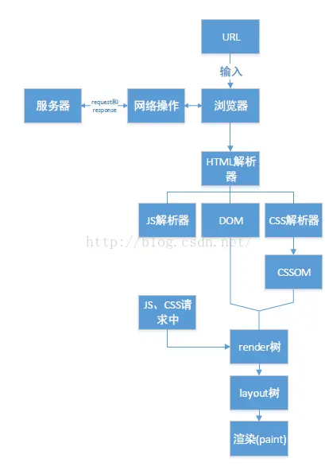
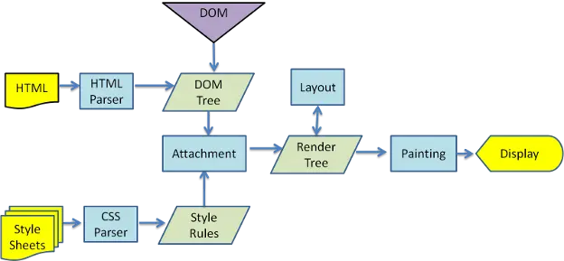

## 浏览器渲染机制

- DOM: `Document Object Model` 浏览器将HTML解析成树形的数据结构，简称DOM
- CSSOM: `CSS Object Model` 浏览器将CSS代码解析成树形的数据结构
- DOM 和 CSSOM 都是以 `Bytes → characters → tokens → nodes → object model`.这样的方式生成最终的数据
- Render Tree: DOM 和 CSSOM 合并后生成 Render Tree

1. 用户输入一个 `URL`, 浏览器会发送一个请求, 请求 `URL` 的资源
2. 浏览器的 `HTML解析器` 会将这个文件解析, 构建一颗 `DOM` 树, (生成 DOM 的最开始阶段(Bytes -> characters)后, 并行发起 `css 图片 js` 的请求)
   1. 注意: 发起 js 文件的下载 request 并不需要 DOM 处理到那个 script 节点
3. 在构建DOM树的时候,遇到 js 和 css 元素, HTML解析器就将控制权转让给`JS解析器`或者`CSS解析器`, 开始构建 `CSSOM`
4. DOM 树构建完之后, 浏览器会把DOM树中的一些不可见元素去掉, 与 CSSOM 合成一颗 `render tree`
5. `Layout`: 有了 `Render Tree`, 浏览器知道网页中有哪些节点, 各个节点的CSS定义以及从属关系, 下一步操作就是 `Layout`, 计算出每个节点在屏幕中的位置
6. `Painting`: 浏览器已经知道了那些节点要显示, 每个节点的CSS属性是什么, 每个节点在屏幕里的位置, 按照算出来的规则, 把内容画到屏幕上

:::tip

上面几个步骤因为 `DOM CSSOM Render Tree` 都可能在第一次 `Painting` 后被更新多次, 比如 JS 修改了 DOM或者CSS属性. layout和Painting也会重复执行, 除了`DOM、CSSOM`更新的原因外，图片下载完成后也需要调用`Layout 和 Painting`来更新网页
:::

## Repaint Reflow

`重绘（repaints）`是一个元素外观的改变所触发的浏览器行为，例如改变vidibility、outline、背景色等属性。浏览器会根据元素的新属性重新绘制，使元素呈现新的外观。重绘不会带来重新布局，并不一定伴随回流。

`回流（reflow）`是更明显的一种改变，可以理解为渲染树需要重新计算

引起重绘和回流的一些操作

- 当你增加、删除、修改 DOM 结点时，会导致 Reflow 或 Repaint
- 当你移动 DOM 的位置，或是搞个动画的时候
- 当你修改 CSS样式的时候
- 当你 Resize 窗口的时候（移动端没有这个问题），或是滚动的时候。
- 当你修改网页的默认字体时
  - 注：`display:none 会触发 reflow，而 visibility:hidden 只会触发 repaint`，因为没有发现位置变化。