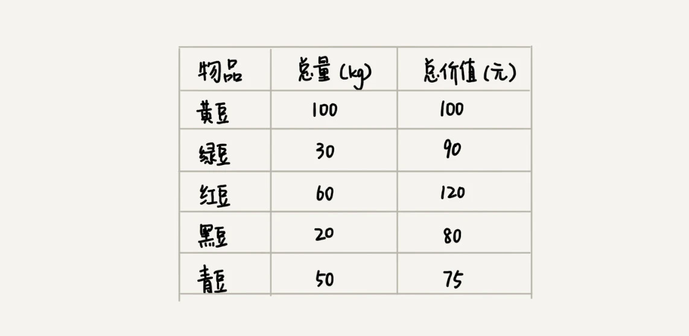
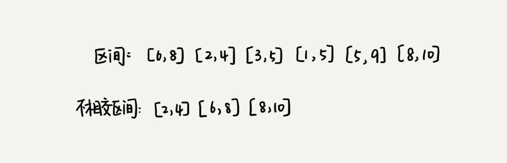
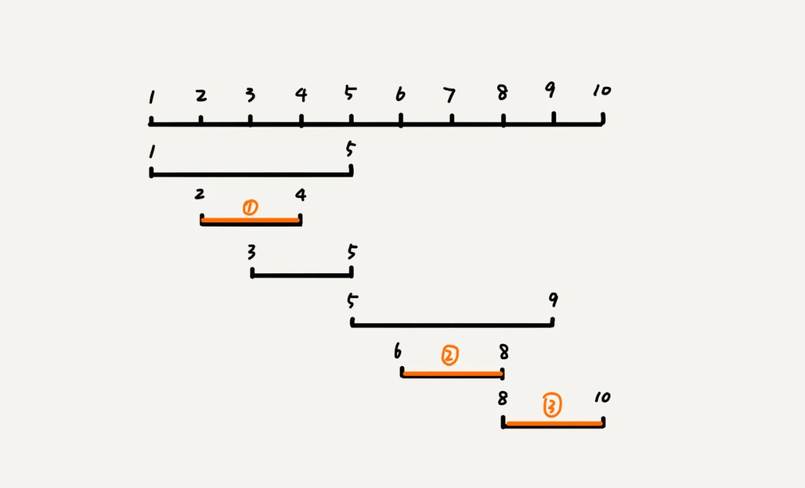
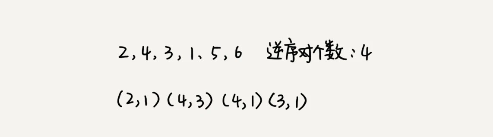
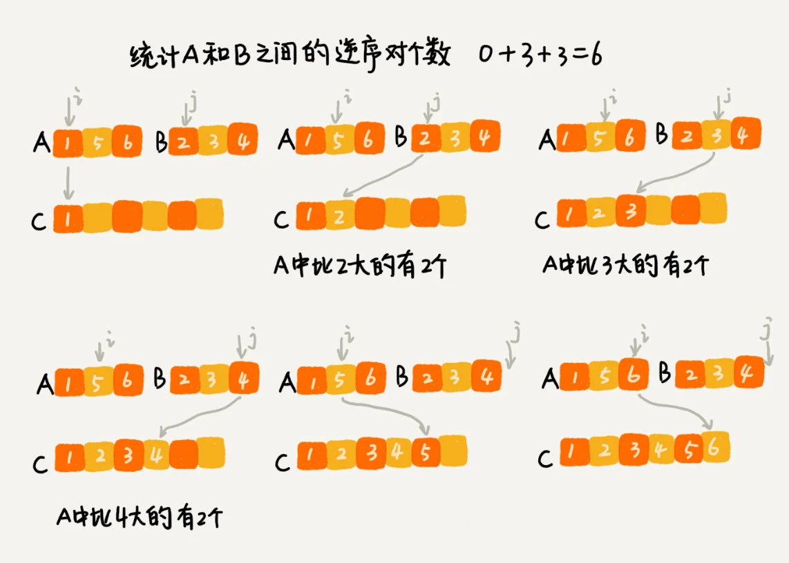
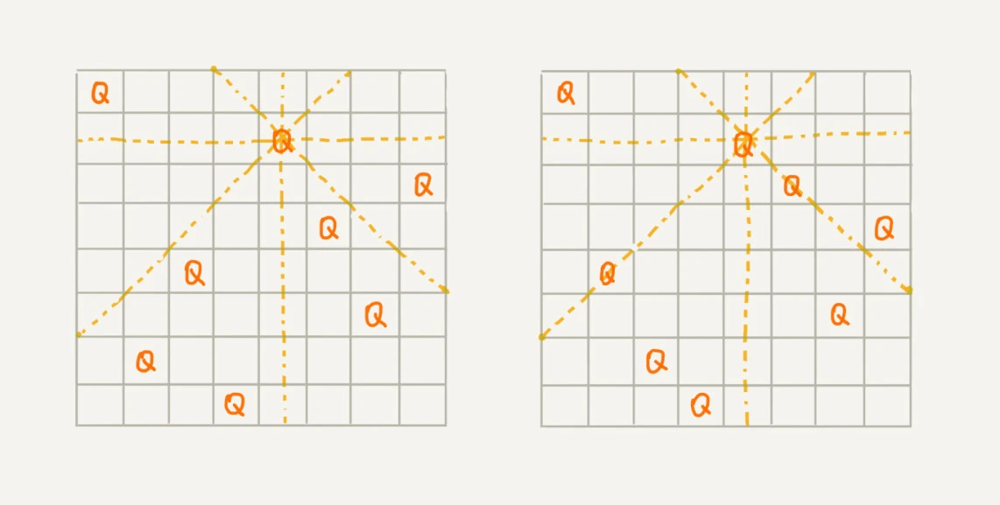

## 贪心算法 greedy algorithm

贪心算法有很多经典的应用，比如`霍夫曼编码（Huffman Coding）、Prim 和 Kruskal 最小生成树算法、还有 Dijkstra 单源最短路径算法`

### 如何理解贪心算法

假设我们有一个可以容纳 100kg 物品的背包，可以装各种物品。我们有以下 5 种豆子，每种豆子的总量和总价值都各不相同。为了让背包中所装物品的总价值最大，我们如何选择在背包中装哪些豆子？每种豆子又该装多少呢



我们只要先算一算每个物品的单价，按照单价由高到低依次来装就好了。单价从高到低排列，依次是：黑豆、绿豆、红豆、青豆、黄豆，所以，我们可以往背包里装 20kg 黑豆、30kg 绿豆、50kg 红豆

- 第一步: 当我们看到这类问题的时候，首先要联想到贪心算法：`针对一组数据，我们定义了限制值和期望值，希望从中选出几个数据，在满足限制值的情况下，期望值最大`。
- 第二步，我们尝试看下这个问题是否可以用贪心算法解决：每次选择当前情况下，在对限制值同等贡献量的情况下，对期望值贡献最大的数据。
- 第三步，我们举几个例子看下贪心算法产生的结果是否是最优的

### 实战 1: 分糖果

我们有 m 个糖果和 n 个孩子。我们现在要把糖果分给这些孩子吃，但是糖果少，孩子多（m<n），所以糖果只能分配给一部分孩子

每个糖果的大小不等，这 `m 个糖果的大小分别是 s1，s2，s3，……，sm`。除此之外，每个孩子对糖果大小的需求也是不一样的，只有糖果的大小大于等于孩子的对糖果大小的需求的时候，孩子才得到满足。假设这 `n 个孩子对糖果大小的需求分别是 g1，g2，g3，……，gn`。

如何分配糖果，能尽可能满足最多数量的孩子？

可以把这个问题抽象成，从 `n 个孩子中，抽取一部分孩子分配糖果，让满足的孩子的个数（期望值）是最大的`。这个问题的限制值就是糖果个数 m。

贪心算法怎么解决: 对于一个孩子来说，如果小的糖果可以满足，我们就没必要用更大的糖果，这样更大的就可以留给其他对糖果大小需求更大的孩子。另一方面，对糖果大小需求小的孩子更容易被满足，所以，我们可以从需求小的孩子开始分配糖果。因为满足一个需求大的孩子跟满足一个需求小的孩子，对我们期望值的贡献是一样的

我们每次从剩下的孩子中，找出对糖果大小需求最小的，然后发给他剩下的糖果中能满足他的最小的糖果，这样得到的分配方案，也就是满足的孩子个数最多的方案。

### 实战 2: 钱币找零

假设我们有 1 元、2 元、5 元、10 元、20 元、50 元、100 元这些面额的纸币，它们的张数分别是 c1、c2、c5、c10、c20、c50、c100。我们现在要用这些钱来支付 K 元，最少要用多少张纸币呢？

在生活中，我们肯定是先用面值最大的来支付，如果不够，就继续用更小一点面值的，以此类推，最后剩下的用 1 元来补齐。

在贡献相同期望值（纸币数目）的情况下，我们希望多贡献点金额，这样就可以让纸币数更少，这就是一种贪心算法的解决思路

### 实战 3: 区间覆盖

假设我们有 n 个区间，区间的起始端点和结束端点分别是[l1, r1]，[l2, r2]，[l3, r3]，……，[ln, rn]。我们从这 n 个区间中选出一部分区间，这部分区间满足两两不相交（端点相交的情况不算相交），最多能选出多少个区间呢？



解决思路是这样的：我们假设这 n 个区间中最左端点是 lmin，最右端点是 rmax。这个问题就相当于，我们选择几个不相交的区间，从左到右将[lmin, rmax]覆盖上。我们按照起始端点从小到大的顺序对这 n 个区间排序。

我们每次选择的时候，`左端点跟前面的已经覆盖的区间不重合的`，`右端点又尽量小的`，这样可以让剩下的未覆盖区间尽可能的大，就可以放置更多的区间。这实际上就是一种贪心的选择方法。



## 分治算法 divide and conquer

分治算法（divide and conquer）的核心思想其实就是四个字，`分而治之` ，也就是将原问题划分成 n 个规模较小，并且结构与原问题相似的子问题，递归地解决这些子问题，然后再合并其结果，就得到原问题的解。

**分治算法是一种处理问题的思想，递归是一种编程技巧**. 分治算法的递归实现中，每一层递归都会涉及这样三个操作：

- 分解: 将源问题分解成一系列子问题
- 解决: 递归地求解各个子问题, 若子问题足够小, 则直接求解
- 合并: 将子问题的结果合并成原问题

分治算法能解决的问题，一般需要满足下面这几个条件：

- 原问题与分解成的小问题具有`相同的模式`
- 原问题分解成的子问题可以独立求解，子问题之间`没有相关性`，这一点是分治算法跟动态规划的明显区别，等我们讲到动态规划的时候，会详细对比这两种算法
- 具有`分解终止条件`，也就是说，当问题足够小时，可以直接求解
- 可以将子问题`合并成原问题`，而这个合并操作的复杂度不能太高，否则就起不到减小算法总体复杂度的效果了。

### 分治算法应用举例分析

在排序算法里讲的数据的有序度、逆序度的概念吗？我当时讲到，我们用`有序度来表示一组数据的有序程度`，用`逆序度表示一组数据的无序程度`

假设我们有 n 个数据，我们期望数据从小到大排列，那完全有序的数据的有序度就是 n(n-1)/2，逆序度等于 0；相反，倒序排列的数据的有序度就是 0，逆序度是 n(n-1)/2。除了这两种极端情况外，我们通过计算有序对或者逆序对的个数，来表示数据的有序度或逆序度。



`如何编程求出一组数据的有序对个数或者逆序对个数呢？`因为有序对个数和逆序对个数的求解方式是类似的，所以你可以只思考逆序对个数的求解方法。

我们套用分治的思想来求数组 A 的逆序对个数。我们可以`将数组分成前后两半 A1 和 A2`，分别计算 A1 和 A2 的逆序对个数 K1 和 K2，然后再计算 A1 与 A2 之间的逆序对个数 K3。那数组 A 的逆序对个数就等于 K1+K2+K3。

使用分治算法其中一个要求是，子问题合并的代价不能太大，否则就起不了降低时间复杂度的效果了。那回到这个问题，如何快速计算出两个子问题 A1 与 A2 之间的逆序对个数呢？

借助归并排序算法了。你可以先试着想想，如何借助归并排序算法来解决呢？

归并排序中有一个非常关键的操作，就是将两个有序的小数组，合并成一个有序的数组。实际上，在这个合并的过程中，我们就可以计算这两个小数组的逆序对个数了。每次合并操作，我们都计算逆序对个数，把这些计算出来的逆序对个数求和，就是这个数组的逆序对个数了。



```java
private int num = 0; // 全局变量或者成员变量

public int count(int[] a, int n) {
  num = 0;
  mergeSortCounting(a, 0, n-1);
  return num;
}

private void mergeSortCounting(int[] a, int p, int r) {
  if (p >= r) return;
  int q = (p+r)/2;
  mergeSortCounting(a, p, q);
  mergeSortCounting(a, q+1, r);
  merge(a, p, q, r);
}

private void merge(int[] a, int p, int q, int r) {
  int i = p, j = q+1, k = 0;
  int[] tmp = new int[r-p+1];
  while (i<=q && j<=r) {
    if (a[i] <= a[j]) {
      tmp[k++] = a[i++];
    } else {
      num += (q-i+1); // 统计p-q之间，比a[j]大的元素个数
      tmp[k++] = a[j++];
    }
  }
  while (i <= q) { // 处理剩下的
    tmp[k++] = a[i++];
  }
  while (j <= r) { // 处理剩下的
    tmp[k++] = a[j++];
  }
  for (i = 0; i <= r-p; ++i) { // 从tmp拷贝回a
    a[p+i] = tmp[i];
  }
}
```

## 回朔算法

回溯的处理思想，有点类似枚举搜索。我们枚举所有的解，找到满足期望的解。为了有规律地枚举所有可能的解，避免遗漏和重复，我们把问题求解的过程分为多个阶段。每个阶段，我们都会面对一个岔路口，我们先随意选一条路走，当发现这条路走不通的时候（不符合期望的解），就回退到上一个岔路口，另选一种走法继续走。

例子: 八皇后问题

我们有一个 8x8 的棋盘，希望往里放 8 个棋子（皇后），每个棋子所在的行、列、对角线都不能有另一个棋子。你可以看我画的图，第一幅图是满足条件的一种方法，第二幅图是不满足条件的。八皇后问题就是期望找到所有满足这种要求的放棋子方式。



我们把这个问题划分成 8 个阶段，依次将 8 个棋子放到第一行、第二行、第三行……第八行。在放置的过程中，我们不停地检查当前放法，是否满足要求。如果满足，则跳到下一行继续放置棋子；如果不满足，那就再换一种放法，继续尝试

回溯算法非常适合用递归代码实现，所以，我把八皇后的算法翻译成代码

```java
int[] result = new int[8];//全局或成员变量,下标表示行,值表示queen存储在哪一列
public void cal8queens(int row) { // 调用方式：cal8queens(0);
  if (row == 8) { // 8个棋子都放置好了，打印结果
    printQueens(result);
    return; // 8行棋子都放好了，已经没法再往下递归了，所以就return
  }
  for (int column = 0; column < 8; ++column) { // 每一行都有8中放法
    if (isOk(row, column)) { // 有些放法不满足要求
      result[row] = column; // 第row行的棋子放到了column列
      cal8queens(row+1); // 考察下一行
    }
  }
}

private boolean isOk(int row, int column) {//判断row行column列放置是否合适
  int leftup = column - 1, rightup = column + 1;
  for (int i = row-1; i >= 0; --i) { // 逐行往上考察每一行
    if (result[i] == column) return false; // 第i行的column列有棋子吗？
    if (leftup >= 0) { // 考察左上对角线：第i行leftup列有棋子吗？
      if (result[i] == leftup) return false;
    }
    if (rightup < 8) { // 考察右上对角线：第i行rightup列有棋子吗？
      if (result[i] == rightup) return false;
    }
    --leftup; ++rightup;
  }
  return true;
}

private void printQueens(int[] result) { // 打印出一个二维矩阵
  for (int row = 0; row < 8; ++row) {
    for (int column = 0; column < 8; ++column) {
      if (result[row] == column) System.out.print("Q ");
      else System.out.print("* ");
    }
    System.out.println();
  }
  System.out.println();
}
```

### 0-1 背包

0-1 背包是非常经典的算法问题，很多场景都可以抽象成这个问题模型。这个问题的经典解法是动态规划，不过还有一种简单但没有那么高效的解法，那就是今天讲的回溯算法

我们有一个背包，背包总的承载重量是 Wkg。现在我们有 n 个物品，每个物品的重量不等，并且不可分割。我们现在期望选择几件物品，装载到背包中。在不超过背包所能装载重量的前提下，如何让背包中物品的总重量最大？

这个背包问题，物品是不可分割的，要么装要么不装，所以叫 0-1 背包问题

对于每个物品来说，都有两种选择，装进背包或者不装进背包。对于 n 个物品来说，总的装法就有 2^n 种，去掉总重量超过 Wkg 的，从剩下的装法中选择总重量最接近 Wkg 的。不过，我们如何才能不重复地穷举出这 2^n 种装法呢？

我们可以把物品依次排列，整个问题就分解为了 n 个阶段，每个阶段对应一个物品怎么选择。先对第一个物品进行处理，选择装进去或者不装进去，然后再递归地处理剩下的物品

```java
public int maxW = Integer.MIN_VALUE; //存储背包中物品总重量的最大值
// cw表示当前已经装进去的物品的重量和；i表示考察到哪个物品了；
// w背包重量；items表示每个物品的重量；n表示物品个数
// 假设背包可承受重量100，物品个数10，物品重量存储在数组a中，那可以这样调用函数：
// f(0, 0, a, 10, 100)
public void f(int i, int cw, int[] items, int n, int w) {
  if (cw == w || i == n) { // cw==w表示装满了;i==n表示已经考察完所有的物品
    if (cw > maxW) maxW = cw;
    return;
  }
  f(i+1, cw, items, n, w);
  if (cw + items[i] <= w) {// 已经超过可以背包承受的重量的时候，就不要再装了
    f(i+1,cw + items[i], items, n, w);
  }
}
```

### 正则表达式

正则表达式里最重要的一种算法思想就是回溯。

正则表达式中，最重要的就是通配符，通配符结合在一起，可以表达非常丰富的语义。为了方便讲解，我假设正则表达式中只包含“_”和“?”这两种通配符，并且对这两个通配符的语义稍微做些改变，其中，`_`匹配任意多个（大于等于 0 个）任意字符，`?`匹配零个或者一个任意字符。基于以上背景假设，我们看下，如何用回溯算法，判断一个给定的文本，能否跟给定的正则表达式匹配？

依次考察正则表达式中的每个字符，当是非通配符时，我们就直接跟文本的字符进行匹配，如果相同，则继续往下处理；如果不同，则回溯。

如果遇到特殊字符的时候，我们就有多种处理方式了，也就是所谓的岔路口，比如“\*”有多种匹配方案，可以匹配任意个文本串中的字符，我们就先随意的选择一种匹配方案，然后继续考察剩下的字符。如果中途发现无法继续匹配下去了，我们就回到这个岔路口，重新选择一种匹配方案，然后再继续匹配剩下的字符。

```java
public class Pattern {
  private boolean matched = false;
  private char[] pattern; // 正则表达式
  private int plen; // 正则表达式长度

  public Pattern(char[] pattern, int plen) {
    this.pattern = pattern;
    this.plen = plen;
  }

  public boolean match(char[] text, int tlen) { // 文本串及长度
    matched = false;
    rmatch(0, 0, text, tlen);
    return matched;
  }

  private void rmatch(int ti, int pj, char[] text, int tlen) {
    if (matched) return; // 如果已经匹配了，就不要继续递归了
    if (pj == plen) { // 正则表达式到结尾了
      if (ti == tlen) matched = true; // 文本串也到结尾了
      return;
    }
    if (pattern[pj] == '*') { // *匹配任意个字符
      for (int k = 0; k <= tlen-ti; ++k) {
        rmatch(ti+k, pj+1, text, tlen);
      }
    } else if (pattern[pj] == '?') { // ?匹配0个或者1个字符
      rmatch(ti, pj+1, text, tlen);
      rmatch(ti+1, pj+1, text, tlen);
    } else if (ti < tlen && pattern[pj] == text[ti]) { // 纯字符匹配才行
      rmatch(ti+1, pj+1, text, tlen);
    }
  }
}
```

## 动态规划 Dynamic Programming

动态规划比较适合用来求解最优问题，比如求最大值、最小值等等

### 0-1 背包问题

讲贪心算法、回溯算法的时候，多次讲到背包问题。

对于一组不同重量、不可分割的物品，我们需要选择一些装入背包，在满足背包最大重量限制的前提下，背包中物品总重量的最大值是多少呢？
