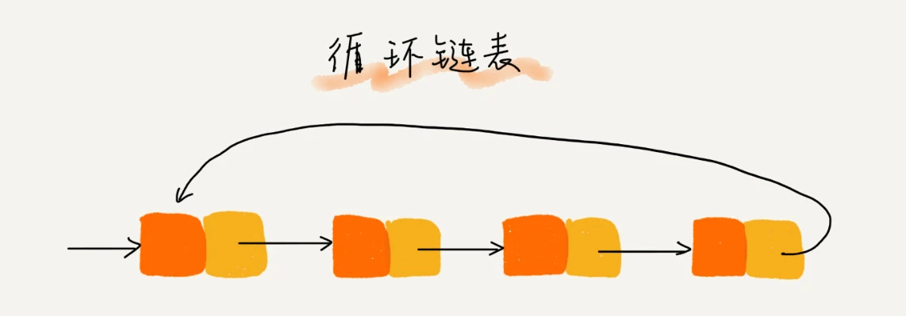

## 什么是数据结构, 什么是算法

广义上说:

- 数据结构就是指一组数据的存储结构 (数据在内存中以何种方式存储)
- 算法就是操作数据的一组方法 (操作这组数据的方法)
- 数据结构是为算法服务的, 算法要作用在特定的数据结构之上

#### 复杂度分析

复杂度也叫渐进复杂度，包括时间复杂度和空间复杂度，用来分析算法执行效率与数据规模之间的增长关系，可以粗略地表示，越高阶复杂度的算法，执行效率越低。

**大 O 复杂度表示法**

算法的执行效率，粗略地讲，就是算法代码执行的时间

```js
// 估算一下这段代码的执行时间
// T(n) = O(n) 只需要记录一个最大量级就可以了 n n平方
function cal(n) {
  let sum = 0
  for (let i = 0; i <= n; i++) {
    sum += i
  }
  return sum
}
```

- 假设上面每行代码执行时间都一样, 为 unit_time
- 2 行代码需要 1 个 uint_time 的执行时间
- 3 4 行都运行了`n`遍, 所以需要 `2n*uint_time`的执行时间
- 总的执行时间为 `(2n+1)*uint_time`, 可以看出来, 所有代码的`执行时间 T(n)` 与每行代码的执行次数成正比

:::tip
规律总结成一个公式: 大 O 登场

- T(n) 表示代码的执行时间
- n 表示数据规模的大小
- f(n) 表示每行代码执行的次数总和
- O 表示代码的执行时间 T(n) 与 f(n) 表达式成正比

$T(n) = O(f(n))$
:::

**时间复杂度分析**

表示代码执行时间随数据规模增长的变化趋势，所以，也叫作渐进时间复杂度（asymptotic time complexity），简称时间复杂度。

1. 只关注循环执行次数最多的一段代码
   - 大 O 这种复杂度表示方法只是表示一种变化趋势。我们通常会忽略掉公式中的常量、低阶、系数，只需要记录一个`最大阶的量级`就可以了
2. 加法法则: 总复杂度等于量级最大的那段代码的复杂度
3. 乘法法则: 嵌套代码的复杂度等于嵌套内外代码复杂度的乘积

**几种常见时间复杂度分析**

1. $O(1)$

O(1) 只是常量级时间复杂度的一种表示方法, 并不是指只执行了一行代码

一般情况下，只要算法中不存在循环语句、递归语句，即使有成千上万行的代码，其时间复杂度也是 Ο(1)。

2. $O(logn) O(nlogn)$

```c
i=1;
while (i <= n)  {
  // 变量 i的值从1开始取, 每循环一次乘以2, 当大于 n时, 循环结束
  // 变量 i 的取值就是一个等比数列
  i = i * 2;
}
```

上面 i 取值列出来就是 $2^0 2^1 2^2 ... 2^x = n$, 通过 $2^x=n$ 求解 x, 就是 $x=log2n$

在采用大 O 标记复杂度的时候，可以忽略系数，即 `O(Cf(n)) = O(f(n))`

所以，O(log2n) 就等于 O(log3n).因此,在对数阶时间复杂度的表示方法里，我们忽略对数的"底", 统一表示为 `O(logn)`

_如果一段代码的时间复杂度是 O(logn)，我们循环执行 n 遍，时间复杂度就是 `O(nlogn)` 了_

3. $O(m+n) O(m*n)$

代码的复杂度由`两个数据的规模`来决定

```c
// m 和 n 是表示两个数据规模
// 无法事先评估 m 和 n 谁的量级大, 就无法省略其中一个
// O(m+n)
int cal(int m, int n) {
  int sum_1 = 0;
  int i = 1;
  for (; i < m; ++i) {
    sum_1 = sum_1 + i;
  }

  int sum_2 = 0;
  int j = 1;
  for (; j < n; ++j) {
    sum_2 = sum_2 + j;
  }

  return sum_1 + sum_2;
}
```

**空间复杂度分析**

前面讲过，时间复杂度的全称是`渐进时间复杂度`，表示算法的执行时间与数据规模之间的增长关系

类比一下，空间复杂度全称就是渐进空间复杂度（asymptotic space complexity），表示`算法的存储空间与数据规模`之间的增长关系

常见的空间复杂度就是 $O(1)、O(n)、O(n2 )$

#### 最好、最坏情况时间复杂度

```c
// n表示数组array的长度
int find(int[] array, int n, int x) {
  int i = 0;
  int pos = -1;
  for (; i < n; ++i) {
    if (array[i] == x) {
       pos = i;
       break;
    }
  }
  return pos;
}
```

上面代码中, 查找的变量 x 可能出现在数组的任意位置

如果数组中第一个元素正好是要查找的变量 x，那就不需要继续遍历剩下的 n-1 个数据了，那时间复杂度就是 O(1)

但如果数组中不存在变量 x，那我们就需要把整个数组都遍历一遍，时间复杂度就成了 O(n)

为了表示代码在不同情况下的不同时间复杂度，我们需要引入三个概念：`最好情况时间复杂度、最坏情况时间复杂度和平均情况时间复杂度`

- 最好情况时间复杂度就是，在最理想的情况下，执行这段代码的时间复杂度 $O(1)$
- 最坏情况时间复杂度就是，在最糟糕的情况下，执行这段代码的时间复杂度 $O(n)$

---

## 数组

什么是数组, 数组是一种`线性表`数据结构. 它用一组`连续的内存空间`, 来存储一组具有相同类型的数据

数组支持随机访问

#### 低效的 "插入"和"删除

假设数组长度为 n, 讲一个数据插入到数组中第 k 个位置, 为了把第 k 个位置腾出来给新的数据, k~n 元素顺序的往后挪一位

- 如果在末尾插入元素, 不需要移动数据, 复杂度 $O(1)$
- 在开头插入元素, 所有的数据都挪一位, 复杂度 $O(n)$
- 所以在每个位置插入元素概率是一样的, 平均情况时间复杂度 $(1+2+..+n)/n=O(n)$

如果我们要删除第 k 个位置的数据，为了内存的连续性，也需要搬移数据，不然中间就会出现空洞，内存就不连续了。

#### 警惕数组的访问越界问题

## 链表

什么是链表, 链表也是一种`线性表`数据结构, 不过, 它并不需要一块连续的内存空间，它通过`指针`将一组零散的内存块串联起来使用

链表五花八门, 最常见的几种为: `单链表、双向链表和循环链表`

#### 单链表

链表通过指针将一组零散的内存块串联在一起。其中，我们把内存块称为链表的`结点`, 为了将所有的结点串起来，每个链表的结点除了存储数据之外，还需要记录链上的下一个结点的地址, 记录下个节点地址的指针叫做 `后继指针 next`

```go
type 链表 struct {
  node string
  next *链表
}
```


- 第一个节点叫做`头结点`, 记录链表的基地址, 有了这个, 可以遍历整条链表
- 最后一个节点叫做`尾节点`, 指向一个`空地址 nil`, 表示这是链表的最后一个结点

#### 循环链表

循环链表是一种特殊的单链表. 它跟单链表的`区别在于尾节点`. 循环链表的尾结点指针指向链表的头结点



循环链表的优点是从链尾到链头比较方便。当要处理的数据具有环型结构特点时，就特别适合采用循环链表

#### 双向链表

双向链表，顾名思义，它支持两个方向，每个结点不止有一个`后继指针 next` 指向后面的结点，还有一个`前驱指针 prev` 指向前面的结点。


如果存储同样多的数据，双向链表要比单链表占用更多的内存空间。虽然两个指针比较浪费存储空间，但可以支持双向遍历

#### 链表删除

1. 删除结点中"值等于某个给定值"的结点
2. 删除给定指针指向的结点。

对于第一种, 不管是单链表还是双向链表，为了查找到值等于给定值的结点，都需要从头结点开始一个一个依次遍历对比，直到找到值等于给定值的结点，然后再通过我前面讲的指针操作将其删除。查找和删除的总时间复杂度 $O(n)$

第二种情况, 单链表不支持获取前驱节点, 双向链表比较有优势, 单链表删除操作需要 $O(n)$ 的时间复杂度, 双向链表只需要在 $O(1)$ 的时间复杂度

#### 链表数组性能

- 数组简单易用, 访问效率更高, 但占用连续内存空间
- 链表在内存中不是连续存储, 无法有效预读, 但没有大小的限制, 天然支持动态扩容; 链表更适合插入、删除操作频繁的场景

#### 轻松写出链表代码

1. 理解指针或引用的含义
   - 将某个变量赋值给指针，实际上就是将这个变量的地址赋值给指针，
   - 或者反过来说，指针中存储了这个变量的内存地址，指向了这个变量，通过指针就能找到这个变量
2. 警惕指针丢失和内存泄露
   - 插入结点时，一定要注意操作的顺序，要先将结点 x 的 next 指针指向结点 b，再把结点 a 的 next 指针指向结点 x，这样才不会丢失指针，导致内存泄漏
   - 删除链表结点时，也一定要记得手动释放内存空间
3. 哨兵
   - 引入哨兵结点，在任何时候，不管链表是不是空，head 指针都会一直指向这个哨兵结点
   - 有哨兵结点的链表叫带头链表; 没有哨兵结点的链表就叫作不带头链表
   - 针对链表的插入、删除操作，需要对插入第一个结点和删除最后一个结点的情况进行特殊处理
4. 留意边界条件处理
   - 如果链表为空时，代码是否能正常工作？
   - 如果链表只包含一个结点时，代码是否能正常工作？
   - 如果链表只包含两个结点时，代码是否能正常工作？
   - 代码逻辑在处理头结点和尾结点的时候，是否能正常工作？
5. 画图, 辅助思考

```go
// 在结点 p 后面插入一个新的结点
new_node.next = p.next;
p.next = new_node;

// 空链表插入第一个结点
if (head == null) {
  head = new_node;
}

// 删除结点 p
p.next = p.next.next;

// 删除链表中的最后一个结点
if (head.next == null) {
   head = null;
}
```


## 栈