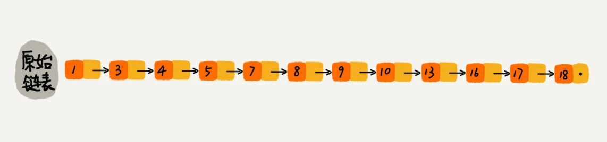
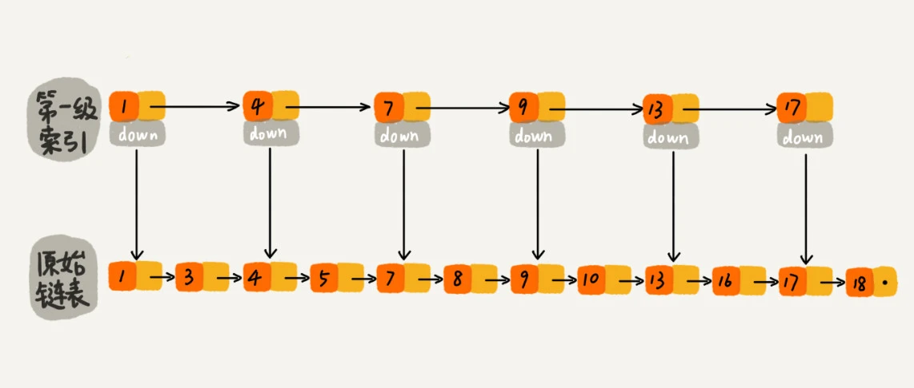
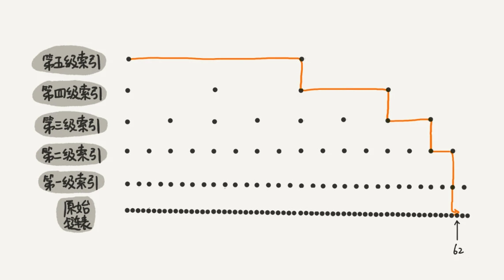

### 跳表 Skip List

只需要对链表稍加改造，就可以支持类似"二分"的查找算法。我们把改造之后的数据结构叫做`跳表（Skip list）`

它是一种各方面性能都比较优秀的`动态数据结构`，可以支持快速地插入、删除、查找操作，写起来也不复杂，甚至可以替代红黑树（Red-black tree）

#### 如何理解 跳表

对于一个单链表来讲, 即便链表中存储的数据是有序的，如果我们要想在其中查找某个数据，也只能从头到尾遍历链表。这样查找效率就会很低，时间复杂度会很高，是 `O(n)`



如何提高查找效率,对链表建立一级"索引", 每两个结点提取一个结点到上一级，我们把抽出来的那一级叫做`索引或索引层`. 图中的 down 表示 down 指针，指向下一级结点



加来一层索引之后，查找一个结点需要遍历的结点个数减少了，也就是说查找效率提高了, 那如果再加一层索引呢?




所以，当链表的长度 n 比较大时，比如 1000、10000 的时候，在构建索引之后，查找效率的提升就会非常明显

**这种链表加多级索引的结构，就是跳表**

:::tip
跳表中查询任意数据的时间复杂度就是 `O(logn)`, 查找的时间复杂度跟二分查找是一样的
:::

### 散列表 Hash Table

散列表的英文叫`Hash Table`, 我们平时也叫它`哈希表`或者`Hash 表`

_散列表用的是数组支持按照下标随机访问数据的特性，所以散列表其实就是数组的一种扩展，由数组演化而来。可以说，如果没有数组，就没有散列表。_

看一个例子: 有 89 名选手参加学校运动会。为了方便记录成绩，每个选手胸前都会贴上自己的参赛号码。这 89 名选手的编号依次是 1 到 89, 参赛编号不能设置得这么简单，要加上年级、班级这些更详细的信息, 把编号的规则稍微修改了一下，用 6 位数字来表示。比如 051167, 前两位 05 表示年级，中间两位 11 表示班级，最后两位还是原来的编号 1 到 89, 我们该如何存储选手信息，才能够支持通过编号来快速查找选手信息呢？

1. 可以`截取参赛编号的后两位作为数组下标`，来存取选手信息数据
2. 当通过参赛编号查询选手信息的时候，我们用同样的方法，取参赛编号的后两位，作为数组下标，来读取数组中的数据
3. 参赛选手的编号我们叫做`键（key）或者关键字`, 用它来标识一个选手
4. 把参赛编号转化为数组下标的映射方法就叫作散列函数（或`Hash 函数 | 哈希函数`），而散列函数计算得到的值就叫作散列值（或`Hash 值 | 哈希值`）


通过散列函数把元素的键值映射为下标，然后将数据存储在数组中对应下标的位置。当我们按照键值查询元素时，我们用同样的散列函数，将键值转化数组下标，从对应的数组下标的位置取数据。

#### 散列函数

散列函数，顾名思义，它是一个函数。我们可以把它定义成 `hash(key)`，其中 `key 表示元素的键值`，hash(key) 的值表示经过散列函数计算得到的散列值

上面的例子, 编号就是数组下标, 所以 `hash(key) = key`

```js
// 伪代码
function hash(key) {
  // 获取后两位字符
  const lastTwoChars = key.substr(length - 2, length)
  // 将后两位字符转换为整数
  const hashValue = Nubmer(lastTwoChars);
  return hashValue;
}
```

该如何构造散列函数呢？我总结了三点散列函数设计的基本要求?

1. 散列函数计算得到的散列值是一个`非负整数`
   - 因为数组下标是从 0 开始的，所以散列函数生成的散列值也要是非负整数
2. 如果 `key1 = key2`, 那 `hash(key1) == hash(key2)`
   - 相同的 key, 经过散列函数得到的散列值也应该是相同的
3. 如果 `key1 != key2`，那 `hash(key1) != hash(key2)`
   - 数组存储空间有限, 会加大散列冲突的概率
   - 几乎无法找到一个完美的无冲突的散列函数


#### 散列冲突

- 开放寻址法 `open addressing`
- 链表法 `chaining`

开放寻址法的核心思想是，如果出现了散列冲突，我们就重新探测一个空闲位置，将其插入, 一个比较简单的探测方法，`线性探测（Linear Probing）`

当我们往散列表中插入数据时，如果某个数据经过散列函数散列之后，存储位置已经被占用了，我们就从当前位置开始，依次往后查找，看是否有空闲位置，直到找到为止