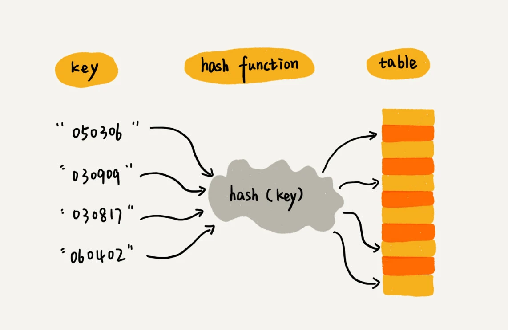

### 跳表 Skip List

只需要对链表稍加改造，就可以支持类似"二分"的查找算法。我们把改造之后的数据结构叫做`跳表（Skip list）`

它是一种各方面性能都比较优秀的`动态数据结构`，可以支持快速地插入、删除、查找操作，写起来也不复杂，甚至可以替代红黑树（Red-black tree）

#### 如何理解 跳表

对于一个单链表来讲, 即便链表中存储的数据是有序的，如果我们要想在其中查找某个数据，也只能从头到尾遍历链表。这样查找效率就会很低，时间复杂度会很高，是 `O(n)`


如何提高查找效率,对链表建立一级"索引", 每两个结点提取一个结点到上一级，我们把抽出来的那一级叫做`索引或索引层`. 图中的 down 表示 down 指针，指向下一级结点


加来一层索引之后，查找一个结点需要遍历的结点个数减少了，也就是说查找效率提高了, 那如果再加一层索引呢?


所以，当链表的长度 n 比较大时，比如 1000、10000 的时候，在构建索引之后，查找效率的提升就会非常明显

**这种链表加多级索引的结构，就是跳表**

:::tip
跳表中查询任意数据的时间复杂度就是 `O(logn)`, 查找的时间复杂度跟二分查找是一样的
:::

### 散列表 Hash Table

散列表的英文叫`Hash Table`, 我们平时也叫它`哈希表`或者`Hash 表`

_散列表用的是数组支持按照下标随机访问数据的特性，所以散列表其实就是数组的一种扩展，由数组演化而来。可以说，如果没有数组，就没有散列表。_

看一个例子: 有 89 名选手参加学校运动会。为了方便记录成绩，每个选手胸前都会贴上自己的参赛号码。这 89 名选手的编号依次是 1 到 89, 参赛编号不能设置得这么简单，要加上年级、班级这些更详细的信息, 把编号的规则稍微修改了一下，用 6 位数字来表示。比如 051167, 前两位 05 表示年级，中间两位 11 表示班级，最后两位还是原来的编号 1 到 89, 我们该如何存储选手信息，才能够支持通过编号来快速查找选手信息呢？

1. 可以`截取参赛编号的后两位作为数组下标`，来存取选手信息数据
2. 当通过参赛编号查询选手信息的时候，我们用同样的方法，取参赛编号的后两位，作为数组下标，来读取数组中的数据
3. 参赛选手的编号我们叫做`键（key）或者关键字`, 用它来标识一个选手
4. 把参赛编号转化为数组下标的映射方法就叫作散列函数（或`Hash 函数 | 哈希函数`），而散列函数计算得到的值就叫作散列值（或`Hash 值 | 哈希值`）



通过散列函数把元素的键值映射为下标，然后将数据存储在数组中对应下标的位置。当我们按照键值查询元素时，我们用同样的散列函数，将键值转化数组下标，从对应的数组下标的位置取数据。

#### 散列函数

散列函数，顾名思义，它是一个函数。我们可以把它定义成 `hash(key)`，其中 `key 表示元素的键值`，hash(key) 的值表示经过散列函数计算得到的散列值

上面的例子, 编号就是数组下标, 所以 `hash(key) = key`

```js
// 伪代码
function hash(key) {
  // 获取后两位字符
  const lastTwoChars = key.substr(length - 2, length)
  // 将后两位字符转换为整数
  const hashValue = Nubmer(lastTwoChars);
  return hashValue;
}
```

该如何构造散列函数呢？我总结了三点散列函数设计的基本要求?

1. 散列函数计算得到的散列值是一个`非负整数`
   - 因为数组下标是从 0 开始的，所以散列函数生成的散列值也要是非负整数
2. 如果 `key1 = key2`, 那 `hash(key1) == hash(key2)`
   - 相同的 key, 经过散列函数得到的散列值也应该是相同的
3. 如果 `key1 != key2`，那 `hash(key1) != hash(key2)`
   - 数组存储空间有限, 会加大散列冲突的概率
   - 几乎无法找到一个完美的无冲突的散列函数


#### 散列冲突

- 开放寻址法 `open addressing`
  - `当数据量比较小、装载因子小的时候，适合采用开放寻址法`
- 链表法 `chaining`
  - `基于链表的散列冲突处理方法比较适合存储大对象、大数据量的散列表，而且，比起开放寻址法，它更加灵活，支持更多的优化策略，比如用红黑树代替链表`

开放寻址法的核心思想是，如果出现了散列冲突，我们就重新探测一个空闲位置，将其插入, 一个比较简单的探测方法，`线性探测（Linear Probing）`

当我们往散列表中插入数据时，如果某个数据经过散列函数散列之后，存储位置已经被占用了，我们就从当前位置开始，依次往后查找，看是否有空闲位置，直到找到为止


**链表法**

散列表中，每个`桶（bucket）或者槽（slot）`会对应一条链表，所有散列值相同的元素我们都放到相同槽位对应的链表中。

- 插入: 需要通过散列函数计算出对应的散列槽位，将其插入到对应链表中即可，所以插入的时间复杂度是 O(1)
- 查找、删除: 同样通过散列函数计算出对应的槽，然后遍历链表查找或者删除


#### 设计散列函数

散列函数设计的好坏，决定了散列表冲突的概率大小，也直接决定了散列表的性能

- 不能过于复杂, 过于复杂的散列函数, 势必会消耗很多计算时间, 也就间接地影响到散列表的性能
- 散列函数生成的值要`尽可能随机并且均匀分布`，这样才能避免或者最小化散列冲突，而且即便出现冲突，散列到每个槽里的数据也会比较平均，不会出现某个槽内数据特别多的情况。


#### 装载因子过大了怎么办

`装载因子 = 散列表中填充的数据/散列表长度` 填充数据越多空闲空间越小(散列表的长度是固定的) 导致装载因子越接近1

装载因子越大，说明散列表中的元素越多，空闲位置越少，散列冲突的概率就越大

针对散列表，当装载因子过大时，我们也可以进行`动态扩容`，重新申请一个更大的散列表，将数据搬移到这个新散列表中

对于动态散列表，随着数据的删除，散列表中的数据会越来越少，空闲空间会越来越多。如果我们对空间消耗非常敏感，我们可以在装载因子小于某个值之后，启动动态缩容


### 哈希算法

#### 什么是哈希算法

将任意长度的二进制值串映射为固定长度的二进制值串, 这个映射的规则就是`哈希算法`

而通过原始数据映射之后得到的二进制值串就是 `哈希值`

- 从哈希值`不能反向推导`出原始数据（所以哈希算法也叫单向哈希算法）
- 对输入`数据非常敏感`，哪怕原始数据只修改了一个 Bit，最后得到的哈希值也大不相同
- `散列冲突的概率要很小`，对于不同的原始数据，哈希值相同的概率非常小
- 哈希算法的`执行效率要尽量高效`，针对较长的文本，也能快速地计算出哈希值

看一下 MD5的哈希算法示例, MD5 的哈希值是 128 位的 Bit 长度，为了方便表示，我把它们转化成了 16 进制编码

```md{1,6}
MD5("今天我来讲哈希算法") = bb4767201ad42c74e650c1b6c03d78fa
MD5("jiajia") = cd611a31ea969b908932d44d126d195b

// 尽管只有一字之差，得到的哈希值也是完全不同的。
MD5("我今天讲哈希算法！") = 425f0d5a917188d2c3c3dc85b5e4f2cb
MD5("我今天讲哈希算法") = a1fb91ac128e6aa37fe42c663971ac3d
```

#### 哈希算法的应用

1. 应用加密
   - 最常用于加密的哈希算法是 `MD5(MD5 Message-Digest Algorithm，MD5 消息摘要算法)`和 `SHA(Secure Hash Algorithm，安全散列算法)`
   - DES（Data Encryption Standard，数据加密标准）、AES（Advanced Encryption Standard，高级加密标准）
2. 唯一标识
   - 例如: 从海量的图库中, 搜索一张图, 任何文件在计算中都可以表示成二进制码串; 我们可以给每一个图片取一个`唯一标识`，或者说`信息摘要`
   - 通过哈希算法（比如 MD5），得到一个哈希字符串，用它作为图片的唯一标识
3. 数据校验
   - 用于校验数据的完整性和正确性
4. 散列函数

5. 负载均衡
   - 负载均衡算法有很多，比如轮询、随机、加权轮询等

那如何才能实现一个会话粘滞（session sticky）的负载均衡算法呢？也就是说，我们需要在同一个客户端上，在一次会话中的所有请求都路由到同一个服务器上。

最直接的方法就是，维护一张映射关系表，这张表的内容是客户端 IP 地址或者会话 ID 与服务器编号的映射关系, 有一些弊端:

- 如果客户端很多，映射表可能会很大，比较浪费内存空间；
- 客户端下线、上线，服务器扩容、缩容都会导致映射失效，这样维护映射表的成本就会很大

另一种方法可以通过哈希算法，对客户端 IP 地址或者会话 ID 计算哈希值，将取得的哈希值与服务器列表的大小进行取模运算，最终得到的值就是应该被路由到的服务器编号


6. 数据分片

*如何统计"搜索关键词"出现的次数？*

假如我们有 1T 的日志文件，这里面记录了用户的搜索关键词，我们想要快速统计出每个关键词被搜索的次数，该怎么做呢？

- 第一个是搜索日志很大，没办法放到一台机器的内存中;
- 第二个难点是，如果只用一台机器来处理这么巨大的数据，处理时间会很长。

可以先对数据进行分片，然后采用多台机器处理的方法，来提高处理速度

具体思路: 为了提高处理的速度，我们用 n 台机器并行处理。我们从搜索记录的日志文件中，依次读出每个搜索关键词，并且通过哈希函数计算哈希值，然后再跟 n 取模，最终得到的值，就是应该被分配到的机器编号。

*如何快速判断图片是否在图库中？*

现在我们的图库中有 1 亿张图片，很显然，在单台机器上构建散列表是行不通的。因为单台机器的内存有限，而 1 亿张图片构建散列表显然远远超过了单台机器的内存上限。

同样可以对数据进行分片，然后采用多机处理。我们准备 n 台机器，让每台机器只维护某一部分图片对应的散列表。我们每次从图库中读取一个图片，计算唯一标识，然后与机器个数 n 求余取模，得到的值就对应要分配的机器编号，然后将这个图片的唯一标识和图片路径发往对应的机器构建散列表。

7. 分布式存储

现在互联网面对的都是海量的数据、海量的用户。我们为了提高数据的读取、写入能力，一般都采用分布式的方式来存储数据，比如分布式缓存。

如何决定将哪个数据放到哪个机器上呢？我们可以借用前面数据分片的思想，即通过哈希算法对数据取哈希值，然后对机器个数取模，这个最终值就是应该存储的缓存机器编号

如果数据增多，原来的 10 个机器已经无法承受了，我们就需要扩容了，比如扩到 11 个机器，这时候麻烦就来了。因为，这里并不是简单地加个机器就可以了

原来的数据是通过与 10 来取模的。比如 13 这个数据，存储在编号为 3 这台机器上。但是新加了一台机器中，我们对数据按照 11 取模，原来 13 这个数据就被分配到 2 号这台机器上了。


所有的数据都要重新计算哈希值，然后重新搬移到正确的机器上。这样就相当于，缓存中的数据一下子就都失效了。所有的数据请求都会穿透缓存，直接去请求数据库。这样就可能发生`雪崩效应`，压垮数据库。

一致性哈希算法:

假设我们有 k 个机器，数据的哈希值的范围是[0, MAX]。我们将整个范围划分成 m 个小区间（m 远大于 k），每个机器负责 m/k 个小区间。当有新机器加入的时候，我们就将某几个小区间的数据，从原来的机器中搬移到新的机器中。这样，既不用全部重新哈希、搬移数据，也保持了各个机器上数据数量的均衡。
