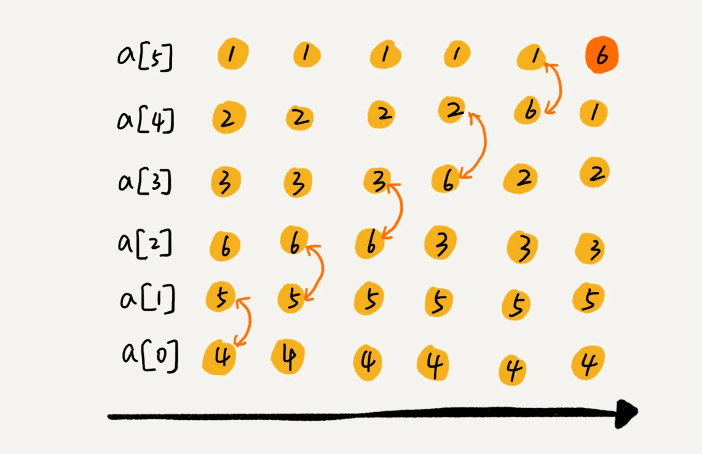
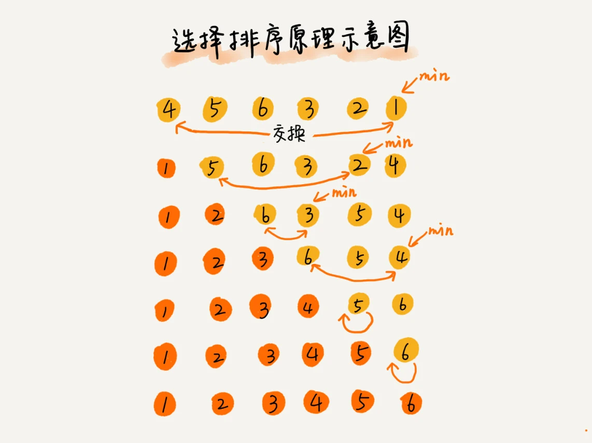

## 递归

#### 理解递归

- 去的过程叫`递`，
- 回来的过程叫`归`

递归需要满足三个条件:

1. 一个问题的解可以分解为几个子问题的解
   - 子问题就是数据规模更小的问题
2. 这个问题与分解之后的子问题，除了数据规模不同，求解思路完全一样
3. 存在递归终止条件

#### 如何编写递归代码

写递归代码最关键的是`写出递推公式，找到终止条件`

看一个例子: 假如这里有 n 个台阶，每次你可以跨 1 个台阶或者 2 个台阶，请问走这 n 个台阶有多少种走法？

1. 根据第一步的走法把所有走法分为两类, 第一类是第一步走了 1 个台阶, 另一类是第一步走了 2 个台阶
2. 所以 n 个台阶的走法就等于先走 1 阶后, `n-1个台阶的走法` + 先走两阶后, `n-2个台阶的走法`
3. 终止条件就是 `f(1) = 1, f(2) = 2`

```md
f(1) = 1;
f(2) = 2;
f(n) = f(n-1)+f(n-2)
```

```js
// 递归方式
function f(n) {
  if (n === 1) return 1
  if (n === 2) return 2
  return f(n - 1) + f(n - 2)
}

// 非递归
function f(n) {
  if (n === 1) return 1
  if (n === 2) return 2

  let ret = 0
  let pre = 2
  let prepre = 1
  for (let i = 3; i <= n; ++i) {
    ret = pre + prepre
    prepre = pre
    pre = ret
  }
  return ret
}
```

:::tip
编写递归代码的关键是，只要遇到递归，我们就把它抽象成一个递推公式，不用想一层层的调用关系，不要试图用人脑去分解递归的每个步骤
:::

#### 递归代码警惕堆栈溢出/重复计算

> 函数调用会使用栈来保存临时变量。每调用一个函数，都会将临时变量封装为栈帧压入内存栈，等函数执行完成返回时，才出栈。系统栈或者虚拟机栈空间一般都不大。如果递归求解的数据规模很大，调用层次很深，一直压入栈，就会有堆栈溢出的风险。

- 限制递归调用的最大深度
  - 递归调用超过一定深度（比如 1000）之后，我们就不继续往下再递归了，直接返回报错

## 排序

#### 如何分析一个排序算法

1. 执行效率
   - 最好情况、最坏情况、平均情况时间复杂度
   - 时间复杂度的系数、常数 、低阶
   - 比较次数和交换（或移动）次数
2. 内存消耗
   - 内存消耗可以通过空间复杂度来衡量，排序算法也不例外, 针对排序算法的空间复杂度，我们还引入了一个新的概念 `原地排序`
   - 原地排序（Sorted in place）。原地排序算法，就是特指空间复杂度是 O(1) 的排序算法
3. 稳定性
   - `2,9,3,4,8,3`
   - 某种排序算法排序之后，如果两个 3 的前后顺序没有改变，那我们就把这种排序算法叫作稳定的排序算法；
   - 如果前后顺序发生变化，那对应的排序算法就叫作不稳定的排序算法。

#### 冒泡排序 (Bubble Sort)

冒泡排序`只会操作相邻的两个数据`. 每次冒泡操作都会对相邻的两个元素进行比较, 看是否满足大小关系要求, 如果不满足就让它两互换.一次冒泡会让至少一个元素移动到它应该在的位置，重复 n 次, 就完成了 n 个数据的排序工作

数据 **4，5，6，3，2，1，从小到大**



经过一次冒泡操作之后，6 这个元素已经存储在正确的位置上。要想完成所有数据的排序，我们只要进行 6 次这样的冒泡操作就行了


```js
// 冒泡排序
function bubbleSort(arr) {
  if (arr.length <= 1) return
  let temp = 0
  for (let i = 0; i < arr.length; i++) {
    // 提前退出冒泡循环的标志位
    let flag = false
    for (let j = 0; j < arr.length - i; j++) {
      if (arr[j] > arr[j + 1]) {
        temp = arr[j]
        arr[j] = arr[j + 1]
        arr[j + 1] = temp
        flag = true
      }
    }
    if (!flag) break
  }
}

bubbleSort([24, 69, 80, 57, 13, 46, 70]) // [13, 24, 46, 57, 69, 70, 80]
```

#### 插入排序 (Insertion Sort)

看一个问题: 一个有序的数组，我们往里面添加一个新的数据后，如何继续保持数据有序呢? 遍历数组, 找到数据插入

是一个`动态排序`的过程，即动态地往有序集合中添加数据，我们可以通过这种方法保持集合中的数据一直有序

1. 将数组中的数据分为两个区间，`已排序区间`和`未排序区间`
2. 初始`已排序区间`只有一个元素，就是`数组的第一个元素`
3. 插入算法的核心思想是`取未排序区间中的元素`，在已排序区间中`找到合适的插入位置将其插入`，并保证已排序区间数据一直有序

如下图, `红色是已排序区间, 黄色是未排序区间`


插入排序也包含两种操作，一种是`元素的比较`，一种是`元素的移动`

```js
function insertionSort(arr) {
  if (arr.length <= 1) return

  for (let i = 1; i < arr.length; i++) {
    let insertValue = arr[i] // 要插入的值
    let insertIndex = i - 1 // 下标

    // 查找插入的位置
    for (; insertIndex >= 0; insertIndex--) {
      if (arr[insertIndex] > insertValue) {
        arr[insertIndex + 1] = arr[insertIndex] // 数据移动
      } else {
        break
      }
    }
    arr[insertIndex + 1] = insertValue // 插入数据
  }

  console.log("arr", arr)
}

insertionSort([24, 69, 80, 57, 13, 46, 70]) // [13, 24, 46, 57, 69, 70, 80]
```

#### 选择排序 (Selection Sort)

选择排序算法的实现思路有点类似插入排序, 也分已排序区间和未排序区间. 但是选择排序每次会从未排序区间中找到最小的元素, 将其放到已排序区间的末尾



```js
function SelectionSort(arr) {
  if (arr.length <= 1) return

  for (let j = 0; j < arr.length; j++) {
    let max = arr[j]
    let maxIndex = j
    for (let i = j + 1; i < arr.length; i++) {
      if (arr[i] > max) {
        // 找到最大的值
        max = arr[i] // 80
        maxIndex = i // 2
      }
    }

    if (maxIndex != 0) {
      swapElements(arr, j, maxIndex)
    }
  }

  console.log("arr", arr)
}

const swapElements = (array, index1, index2) => {
  let temp = array[index1]
  array[index1] = array[index2]
  array[index2] = temp
}

SelectionSort([24, 69, 80, 57, 13, 46, 70])
```

#### 归并排序 (Merge Sort)

如果要排序一个数组，我们先把数组从中间分成前后两部分，然后对前后两部分分别排序，再将排好序的两部分合并在一起，这样整个数组就都有序了。


归并排序使用的就是分治思想。分治，顾名思义，就是分而治之，将一个大问题分解成小的子问题来解决。小的子问题解决了，大问题也就解决了

分治是一种解决问题的处理思想，递归是一种编程技巧

```js
function MergeSort(arr) {
  if (arr.length === 1) return arr
  const midIdx = Math.floor(arr.length / 2)
  return Merge(MergeSort(arr.slice(0, midIdx)), MergeSort(arr.slice(midIdx)))
}

function Merge(leftArr, rightArr) {
  let temp = []
  while (leftArr.length > 0 && rightArr.length > 0) {
    if (leftArr[0] < rightArr[0]) {
      temp.push(leftArr.shift())
    } else {
      temp.push(rightArr.shift())
    }
  }
  return temp.concat(leftArr).concat(rightArr)
}

MergeSort([24, 69, 80, 57, 13, 46, 70])
```

#### 快速排序 (Quick Sort)

快排利用的也是分治思想

快排的思想是这样的:

1. 如果要排序数组中`下标从 p 到 r 之间`的一组数据，我们选择 `p 到 r 之间的任意一个数据作为 pivot（分区点）`
2. 我们遍历 p 到 r 之间的数据，将`小于 pivot 的放到左边`，将`大于 pivot 的放到右边`，将 `pivot 放到中间`
3. 经过这一步骤之后，数组 `p 到 r 之间的数据就被分成了三个部分`，前面 p 到 q-1 之间都是小于 pivot 的，中间是 pivot，后面的 q+1 到 r 之间是大于 pivot 的。


用递归排序下标从 p 到 q-1 之间的数据和下标从 q+1 到 r 之间的数据，直到区间缩小为 1，就说明所有的数据都有序了

```md{2,5}
递推公式：
quick_sort(p…r) = quick_sort(p…q-1) + quick_sort(q+1… r)

终止条件：
p >= r
```


```js
const QuickSort = function (arr) {
  if (arr.length <= 1) {
    return arr
  }
  var pivotIndex = Math.floor(arr.length / 2)
  var pivot = arr.splice(pivotIndex, 1)[0]
  var left = []
  var right = []

  for (var i = 0; i < arr.length; i++) {
    if (arr[i] < pivot) {
      left.push(arr[i])
    } else {
      right.push(arr[i])
    }
  }
  return QuickSort(left).concat([pivot], QuickSort(right))
}

console.log(QuickSort([24, 69, 80, 57, 13, 46, 70]))
```

#### 选择合适的排序


## 二分查找

#### 无处不在的二分思想

二分查找是一种非常简单易懂的快速查找算法, 我们平时玩游戏, 猜数字, 告诉你大了、小了, 直到猜中, 这就是二分思想

看一个实际例子: 假如有 1000 条订单, 已经按照金额从小到大排序, 想找等于 19 元 的订单, 可以利用二分思想, 每次都与区间的中间数据比较大小, 缩小查找范围.


- 二分查找针对的是一个`有序的数据集合`，查找思想有点类似分治思想
- 每次都通过跟区间的中间元素对比，将待查找的区间缩小为之前的一半，直到找到要查找的元素，或者区间被缩小为 0

#### 二分查找的递归与分递归实现

不重复有序数组查找给定值,

二分查找容易出错的地方:

1. 循环退出条件 `low <= high`, 不是 `low < high`
2. mid 的取值: `mid=(low+high)/2` 如果数据较大, 两者之和会溢出.
   - `low+(high-low)/2` 或者 `low+((high-low)>>1)`
3. low 和 high 的更新: `low=mid+1，high=mid-1`

```js
// 循环
function search(arr, val) {
  let low = 0
  let high = arr.length - 1

  while (low <= high) {
    let mid = Math.floor((low + high) / 2)
    if (arr[mid] === val) {
      return mid
    } else if (arr[mid] < val) {
      low = mid + 1
    } else {
      high = mid - 1
    }
  }

  return -1
}

const index = search([1, 3, 5, 7, 9, 11, 15], 3)
console.log("index", index) // 1

// 递归
function search(arr, val) {
  return searchInternally(arr, 0, arr.length - 1, val)
}

function searchInternally(arr, low, high, val) {
  if (low > high) {
    return -1
  }

  let mid = low + ((high - low) >> 1)
  if (arr[mid] == val) {
    return mid
  } else if (arr[mid] < val) {
    return searchInternally(arr, mid + 1, high, val)
  } else {
    return searchInternally(arr, low, mid - 1, val)
  }
}

const index = search([1, 3, 5, 7, 9, 11, 15], 3)
console.log("index", index)
```

#### 二分查找的局限性

1. 二分查找依赖的是顺序表结构，简单点说就是数组
2. 二分查找针对的是有序数据, 数据必须是有序的。如果数据没有序，我们需要先排序
3. 数据量太小不适合二分查找

#### 二分查找的变形问题

数据是从小到大排列为前提

有序数据集合中`存在重复的数据`，我们希望找到第一个值等于给定值的数据，这样之前的二分查找代码还能继续工作吗？

下图中, `arr[5] arr[6] arr[7]` 都是 8, 第一个等于 8 的数据, 怎么用二分查找


1. 查找`第一个值`等于给定值的元素

```js
function search(arr, val) {
  let low = 0
  let high = arr.length - 1

  while (low <= high) {
    let mid = low + ((high - low) >> 1)
    if (arr[mid] > val) {
      high = mid - 1
    } else if (arr[mid] < val) {
      low = mid + 1
    } else {
      // 当 mid 下标为 0, 或者 数组mid 前一个值 和val 不相等, 就是 mid
      if (mid === 0 || arr[mid - 1] != val) {
        return mid
      } else {
        // 进入这里说明, mid的前一个值和 mid 重复, 设置high的下标
        high = mid - 1
      }
    }
  }

  return -1
}

const index = search([1, 3, 4, 5, 6, 8, 8, 8, 11, 18], 8)
console.log("index", index) // 5
```

2. 查找`最后一个值`等于给定值的元素

```js
function search(arr, val) {
  let low = 0
  let high = arr.length - 1

  while (low <= high) {
    let mid = low + ((high - low) >> 1)
    if (arr[mid] > val) {
      high = mid - 1
    } else if (arr[mid] < val) {
      low = mid + 1
    } else {
      // 和上面的区别在于, 我要看是不是最后一个, 或者 后一个是否相等
      if (mid === arr.length - 1 || arr[mid + 1] != val) {
        return mid
      } else {
        low = mid + 1
      }
    }
  }

  return -1
}

const index = search([1, 3, 4, 5, 6, 8, 8, 8, 11, 18], 8)
console.log("index", index) // 7
```

3. 查找`第一个大于等于`给定值的元素

```js
function search(arr, val) {
  let low = 0
  let high = arr.length - 1

  while (low <= high) {
    let mid = low + ((high - low) >> 1)
    if (arr[mid] >= val) {
      if (mid === 0 || arr[mid - 1] < val) {
        return mid
      } else {
        high = mid - 1
      }
    } else {
      low = mid + 1
    }
  }

  return -1
}

const index = search([3, 4, 6, 7, 11, 18], 5)
console.log("index", index) // 2
```

4. 查找`最后一个小于等于`给定值的元素

```js
function search(arr, val) {
  let low = 0
  let high = arr.length - 1

  while (low <= high) {
    let mid = low + ((high - low) >> 1)
    if (arr[mid] > val) {
      high = mid - 1
    } else {
      if (mid === arr.length - 1 || arr[mid + 1] > val) {
        return mid
      } else {
        low = mid + 1
      }
    }
  }

  return -1
}

const index = search([3, 4, 6, 7, 11, 18], 5)
console.log("index", index) // 1
```
