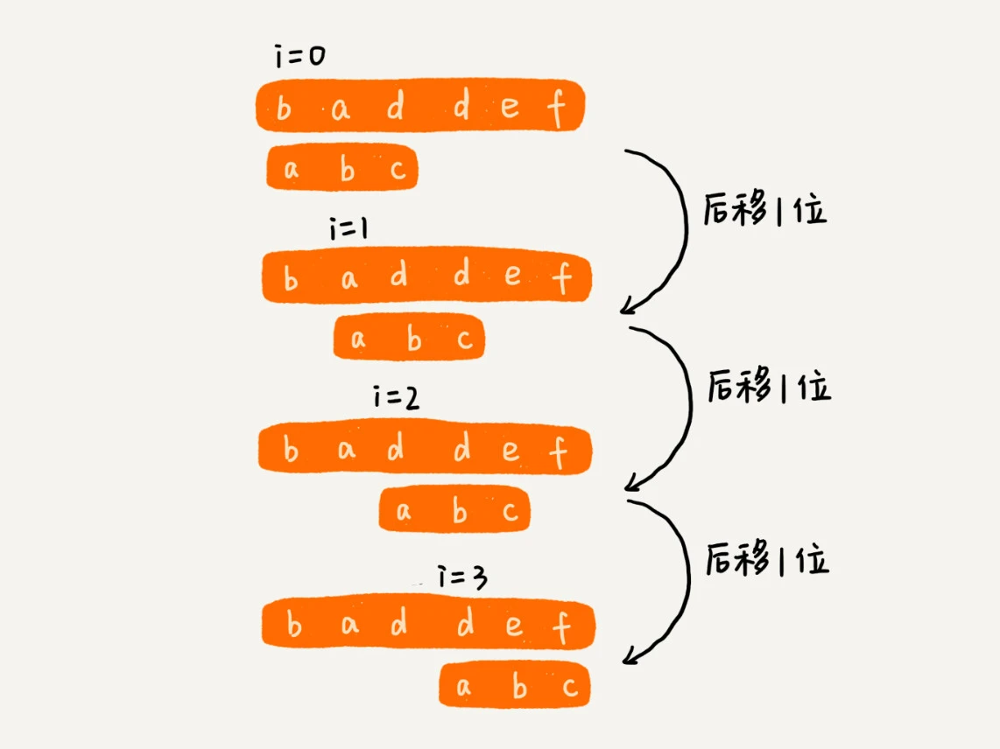
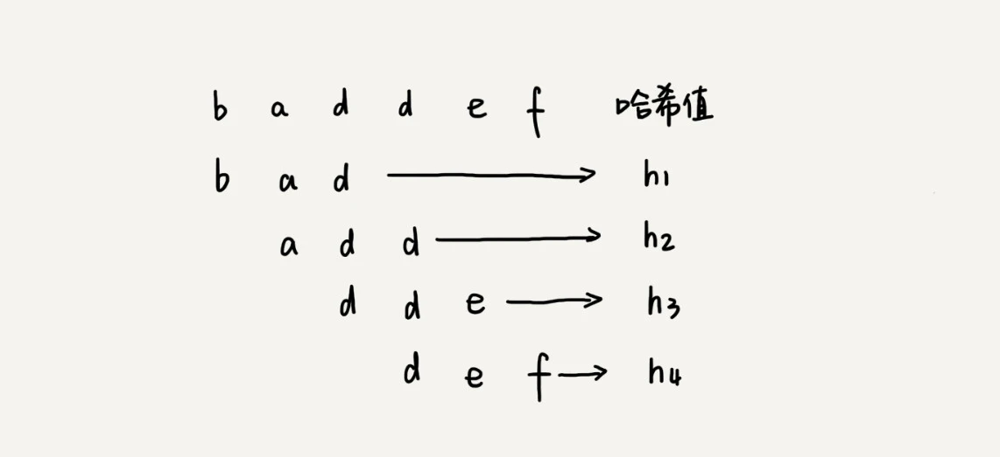
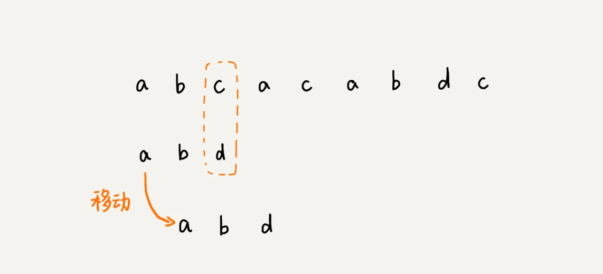
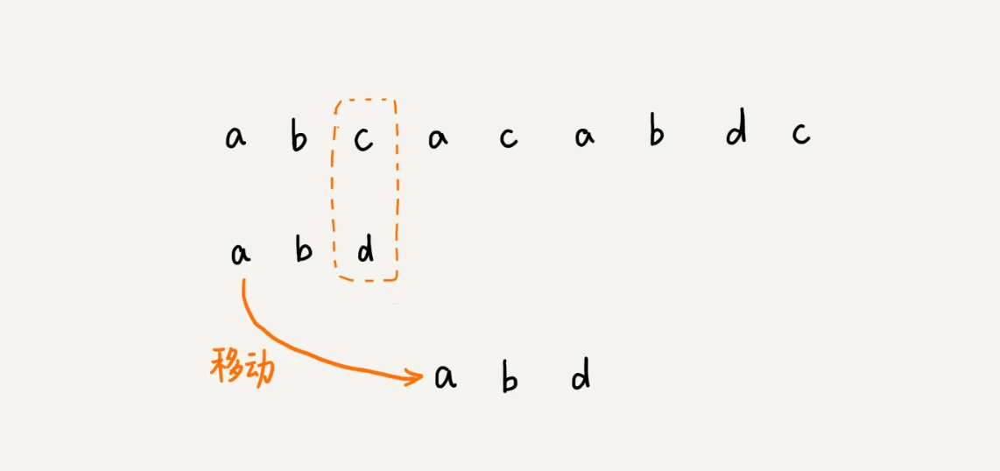
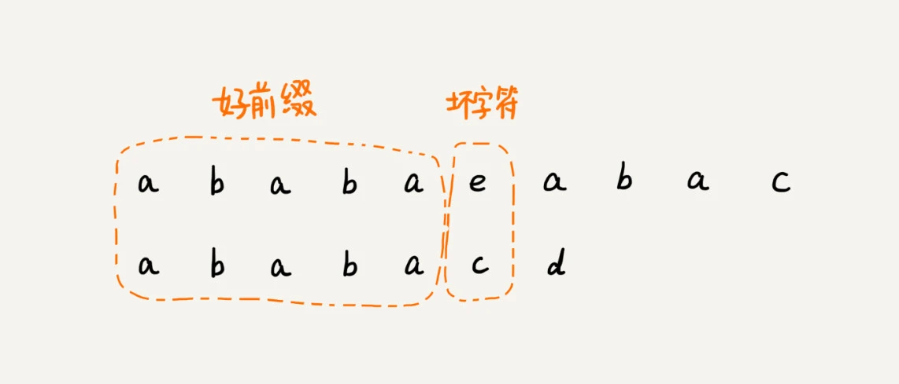
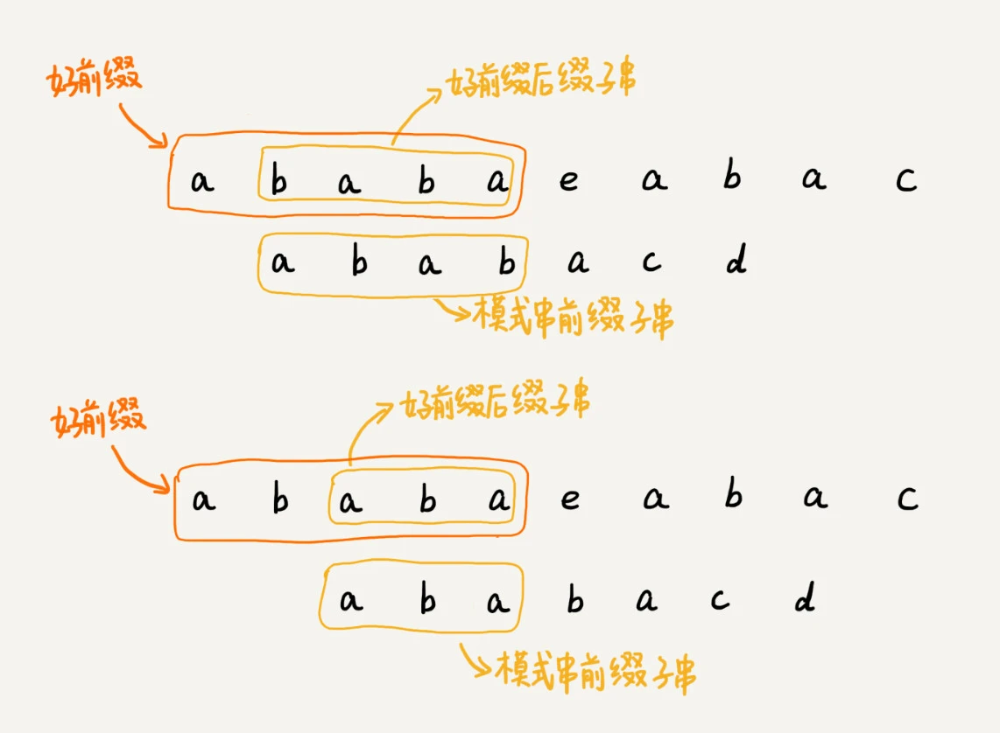
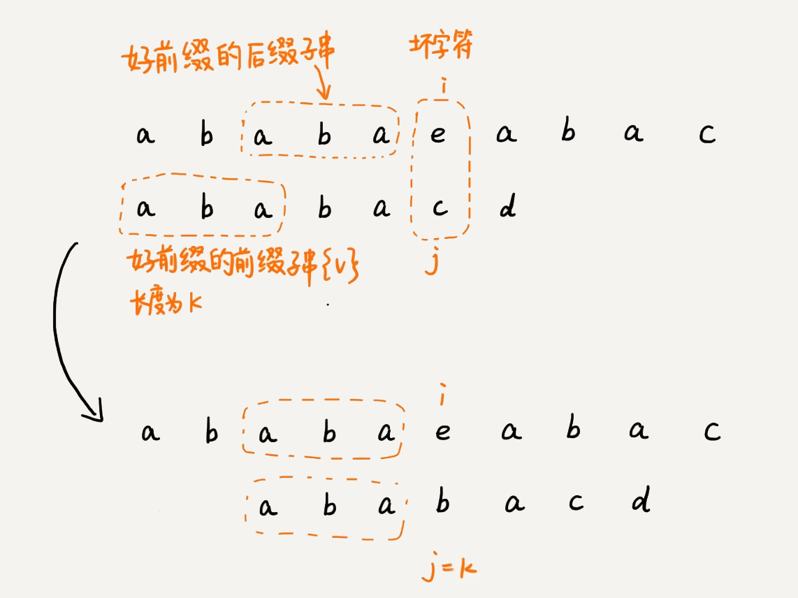
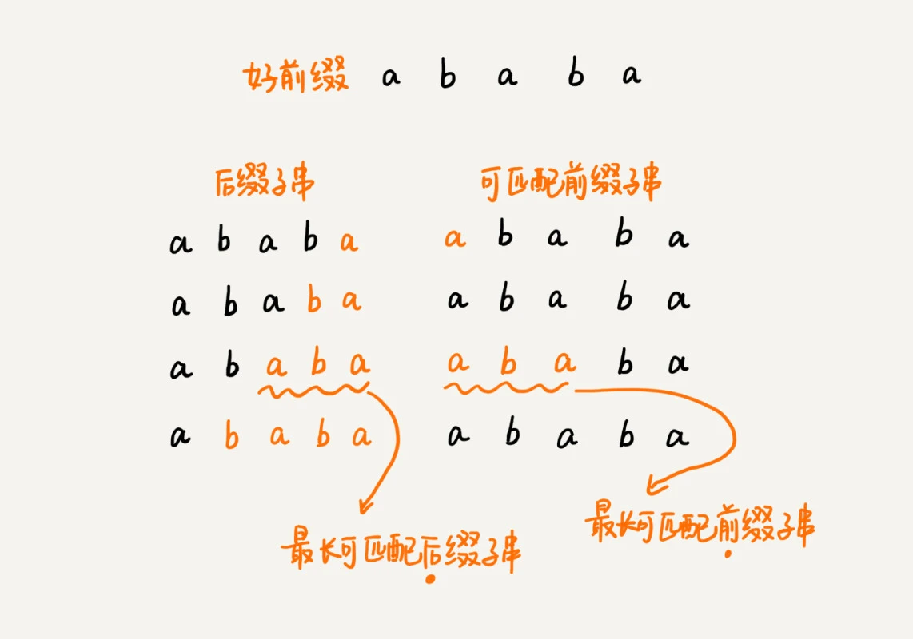

学习字符串匹配算法, 用的最多的就是字符串查找 `indexOf() find()` 等, 底层就是依赖下面的字符串匹配算法

先定义两个概念: `主串`和`模式串`

- 在字符串 A 中查找字符串 B，那字符串 A 就是主串，字符串 B 就是模式串
- 把主串的长度记作 n，模式串的长度记作 m。因为我们是在主串中查找模式串，所以 `n>m`

## BF 算法

`BF` 算法就是 `Brute Force` 的缩写, 中文叫`暴力匹配算法`, 也叫`朴素匹配算法`

BF 算法的思想可以用一句话来概括，那就是，`我们在主串中，检查起始位置分别是 0、1、2....n-m 且长度为 m 的 n-m+1 个子串，看有没有跟模式串匹配的`

## RK 算法

`RK` 算法的全称叫 Rabin-Karp 算法，是由它的两位发明者 Rabin 和 Karp 的名字来命名的, 就是刚刚讲的 BF 算法的升级版

RK 算法的思路是这样的：我们通过哈希算法对`主串中的 n-m+1 个子串分别求哈希值`，然后逐个`与模式串的哈希值比较大小`。如果某个子串的哈希值与模式串相等，那就说明对应的子串和模式串匹配了（这里先不考虑哈希冲突的问题，后面我们会讲到）。因为哈希值是一个数字，数字之间比较是否相等是非常快速的，所以模式串和子串比较的效率就提高了

## BM 算法

BM 算法的核心思想:

把模式串和主串的匹配过程，看作模式串在主串中不停地往后滑动。当遇到不匹配的字符时，BF 算法和 RK 算法的做法是，模式串往后滑动一位，然后从模式串的第一个字符开始重新匹配

在上面的例子中, 主串中的 c, 在模式串中是不存在的, 所以, 模式串向后滑动的时候, 只要 c 与模式串没有重合, 肯定无法匹配. 所以, 可以一次性把模式串往后多滑动几位, 把模式串移动到 c 的后面

由现象找规律, 借助这种规律，在模式串与主串匹配的过程中，当模式串和主串某个字符不匹配的时候，能够跳过一些肯定不会匹配的情况，将模式串往后多滑动几位

**BM 算法原理分析**

- 坏字符规则(bad character rule)
- 好后缀规则(good suffix shift)

:::danger
先理解思想, 具体原理后面分析
:::

## KMP 算法

`KMP` 算法是根据三位作者（D.E.Knuth，J.H.Morris 和 V.R.Pratt）的名字来命名的，算法的全称是 Knuth Morris Pratt 算法，简称为 KMP 算法

KMP 算法的核心思想，跟上一节讲的 BM 算法非常相近。我们`假设主串是 a，模式串是 b。在模式串与主串匹配的过程中，当遇到不可匹配的字符的时候，我们希望找到一些规律，可以将模式串往后多滑动几位，跳过那些肯定不会匹配的情况`

- 把不能匹配的那个字符仍然叫作`坏字符`
- 把已经匹配的那段字符串叫作`好前缀`

当遇到坏字符的时候，我们就要把模式串往后滑动，在滑动的过程中，只要模式串和好前缀有上下重合，前面几个字符的比较，就相当于拿好前缀的后缀子串，跟模式串的前缀子串在比较. 这个比较的过程能否更高效了呢？可以不用一个字符一个字符地比较了吗？

KMP 算法就是在试图寻找一种规律：`在模式串和主串匹配的过程中，当遇到坏字符后，对于已经比对过的好前缀，能否找到一种规律，将模式串一次性滑动很多位？`

我们只需要拿好前缀本身，在它的后缀子串中，查找最长的那个可以跟好前缀的前缀子串匹配的。假设最长的可匹配的那部分前缀子串是{v}，长度是 k。我们把模式串一次性往后滑动 j-k 位，相当于，每次遇到坏字符的时候，我们就把 j 更新为 k，i 不变，然后继续比较。

我把好前缀的所有后缀子串中，最长的可匹配前缀子串的那个后缀子串，叫作`最长可匹配后缀子串`；对应的前缀子串，叫作`最长可匹配前缀子串`。

:::danger
先理解思想, 具体原理后面分析
:::