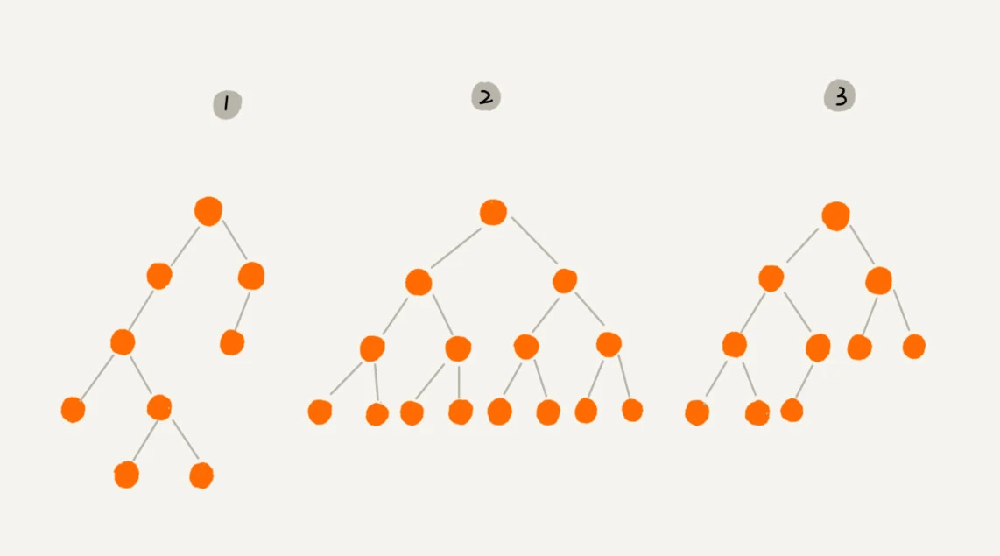
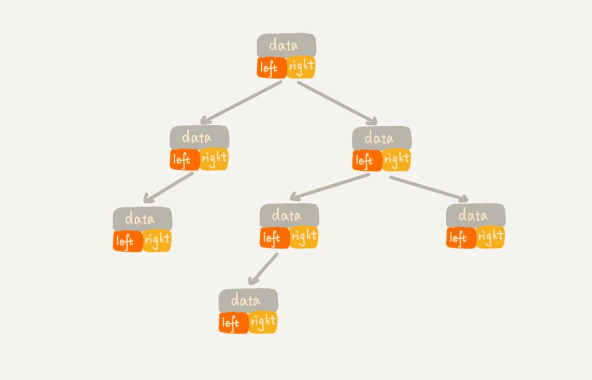
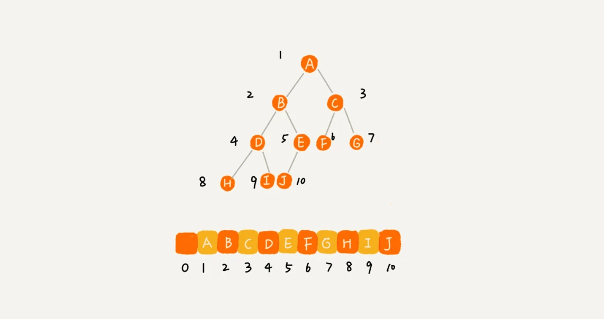
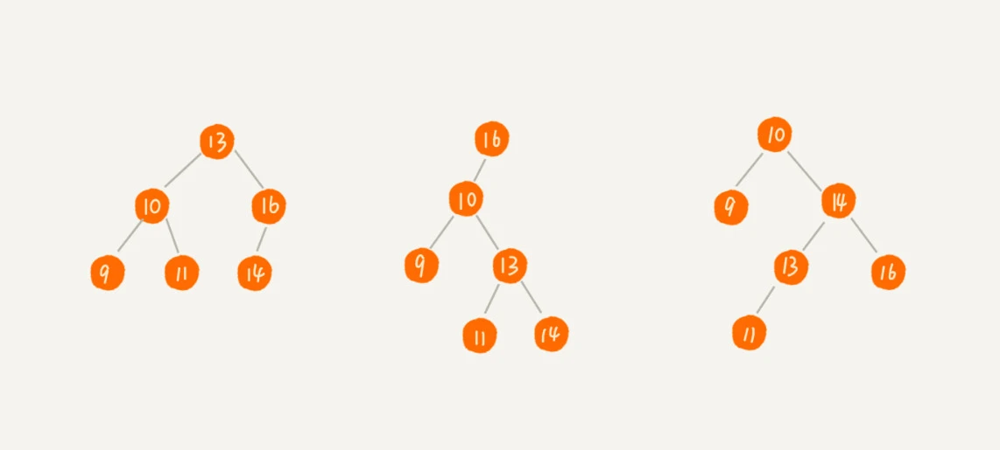
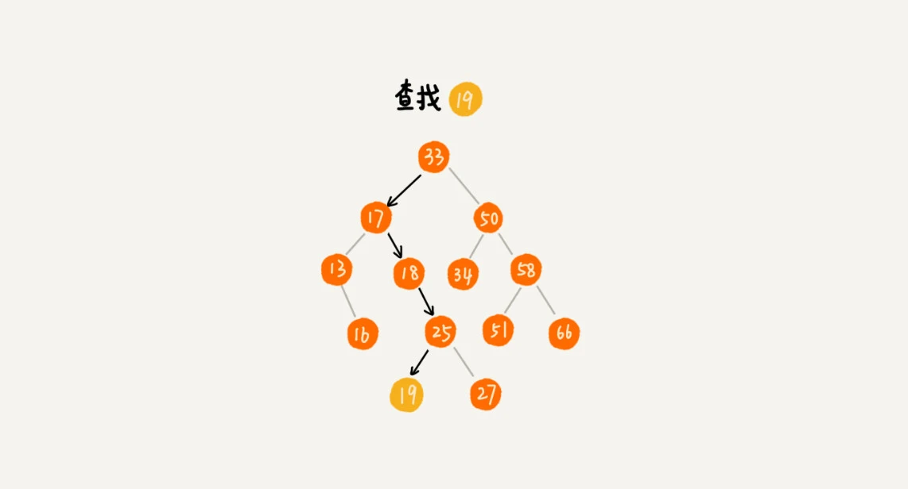

### 树 Tree


"树"这种数据结构真的很像我们现实生活中的"树",这里面每个元素我们叫做"节点"; 用来连接相邻节点之间的关系, 我们叫做"父子关系"


- A 节点就是 B 节点的父节点
- B 节点是 A 节点的子节点。
- B、C、D 这三个节点的父节点是同一个节点，所以它们之间互称为兄弟节点。
- 我们把`没有父节点的节点叫做根节点`，也就是图中的节点 E。
- 我们把`没有子节点的节点叫做叶子节点或者叶节点`，比如图中的 G、H、I、J、K、L 都是叶子节点。

关于“树”，还有三个比较相似的概念：`高度（Height）、深度（Depth）、层（Level）`

- 节点的高度: 节点到叶子节点的`最长路径`, 从底层开始往上数, 并且计数七点为 0
- 节点的深度: 根节点到这个节点所经历的边的个数, 从上往下度量, 计数起点也是 0
- 节点的层数: 节点的深度 + 1
- 树的高度 = 根节点的高度


### 二叉树 Binary Tree

二叉树，顾名思义，每个节点`最多`有两个“叉”，也就是两个子节点，分别是**左子节点和右子节点**

二叉树并不要求每个节点都有两个子节点，有的节点只有左子节点，有的节点只有右子节点



- 编号 2 的二叉树, 叶子节点全都在最底层，除了叶子节点之外，每个节点都有左右两个子节点，这种二叉树就叫做`满二叉树`
- 编号 3 的二叉树中，
  - 叶子节点`都在最底下两层`，
  - `最后一层的叶子节点都靠左排列`，
  - 并且`除了最后一层，其他层的节点个数都要达到最大`，这种二叉树叫做`完全二叉树`

#### 如何表示或存储一颗二叉树?

- 一种基于指针或者引用的二叉链式存储法
- 基于数组的顺序存储法

_链式存储法_

每个节点有三个字段，其中一个存储数据，另外两个是指向左右子节点的指针



_数组的顺序存储法_

把根节点存储在`下标 i = 1` 的位置，那左子节点存储在`下标 2 * i = 2` 的位置，右子节点存储在 `2 * i + 1 = 3` 的位置



上面是一颗完全二叉树, 仅浪费了一个下标为 0 的存储位置, 如果是非完全二叉树, 会浪费比较多存储空间

如果某棵二叉树是一棵`完全二叉树，那用数组存储`无疑是最节省内存的一种方式

也是为什么完全二叉树要求最后一层的子节点都靠左的原因

#### 二叉树的遍历

- 前序遍历是指，对于树中的任意节点来说，先打印这个节点，然后再打印它的左子树，最后打印它的右子树。
- 中序遍历是指，对于树中的任意节点来说，先打印它的左子树，然后再打印它本身，最后打印它的右子树。
- 后序遍历是指，对于树中的任意节点来说，先打印它的左子树，然后再打印它的右子树，最后打印这个节点本身。


二叉树的前、中、后序遍历就是一个递归的过程。

```java
前序遍历的递推公式：
preOrder(r) = print r->preOrder(r->left)->preOrder(r->right)

中序遍历的递推公式：
inOrder(r) = inOrder(r->left)->print r->inOrder(r->right)

后序遍历的递推公式：
postOrder(r) = postOrder(r->left)->postOrder(r->right)->print r
```

```java
void preOrder(Node* root) {
  if (root == null) return;
  print root // 此处为伪代码，表示打印root节点
  preOrder(root->left);
  preOrder(root->right);
}

void inOrder(Node* root) {
  if (root == null) return;
  inOrder(root->left);
  print root // 此处为伪代码，表示打印root节点
  inOrder(root->right);
}

void postOrder(Node* root) {
  if (root == null) return;
  postOrder(root->left);
  postOrder(root->right);
  print root // 此处为伪代码，表示打印root节点
}
```

### 二叉查找树

二叉查找树是二叉树中最常用的一种类型，也叫二叉搜索树, 二叉查找树是为了实现快速查找而生的。不过，它不仅仅支持快速查找一个数据，还支持快速插入、删除一个数据

二叉查找树要求，在树中的`任意一个节点，其左子树中的每个节点的值，都要小于这个节点的值，而右子树节点的值都大于这个节点的值`



#### 查找操作

如何在二叉查找树中查找一个节点?

1. 先取根节点，如果它等于我们要查找的数据，那就返回
2. 如果要查找的数据比根节点的值小，那就在左子树中递归查找
3. 如果要查找的数据比根节点的值大，那就在右子树中递归查找



```java
public class BinarySearchTree {
  private Node tree;

  public Node find(int data) {
    Node p = tree;
    while (p != null) {
      if (data < p.data) p = p.left;
      else if (data > p.data) p = p.right;
      else return p;
    }
    return null;
  }

  public static class Node {
    private int data;
    private Node left;
    private Node right;

    public Node(int data) {
      this.data = data;
    }
  }
}
```


#### 插入操作

新插入的数据一般都是在叶子节点上，所以我们只需要从根节点开始，依次比较要插入的数据和节点的大小关系

1. 如果要插入的数据比节点的数据大，并且节点的右子树为空，就将新数据直接插到右子节点的位置；
2. 如果不为空，就再递归遍历右子树，查找插入位置
3. 同理，如果要插入的数据比节点数值小，并且节点的左子树为空，就将新数据插入到左子节点的位置；
4. 如果不为空，就再递归遍历左子树，查找插入位置。


#### 删除操作

针对要删除节点的子节点个数的不同，我们需要分三种情况来处理

1. 第一种情况是，如果要删除的节点没有子节点，我们只需要直接将父节点中，指向要删除节点的指针置为 null。比如图中的删除节点 55
2. 第二种情况是，如果要删除的节点只有一个子节点（只有左子节点或者右子节点），我们只需要更新父节点中，`指向要删除节点的指针，让它指向要删除节点的子节点就可以了`。比如图中的删除节点 13。
3. 第三种情况是，如果要删除的节点有两个子节点，这就比较复杂了
   1. 我们需要找到这个节点的右子树中的最小节点，把它替换到要删除的节点上
   2. 然后再删除掉这个最小节点，因为最小节点肯定没有左子节点（如果有左子结点，那就不是最小节点了）
   3. ，所以，我们可以应用上面两条规则来删除这个最小节点。比如图中的删除节点 18。


#### 支持重复数据的二叉查找树

在实际的软件开发中，我们在二叉查找树中存储的，是一个包含很多字段的对象。我们利用`对象的某个字段作为键值（key）`来构建二叉查找树。我们把对象中的其他字段叫作`卫星数据`。


那如果存储的两个对象键值相同，这种情况该怎么处理呢？

1. 二叉查找树中每一个节点不仅会存储一个数据，因此我们通过链表和支持动态扩容的数组等数据结构，把值相同的数据都存储在同一个节点上
2. 在查找插入位置的过程中，如果碰到一个节点的值，与要插入数据的值相同，我们就将这个要插入的数据放到这个节点的右子树，也就是说，把这个新插入的数据当作大于这个节点的值来处理。
   1. 当要查找数据的时候，遇到值相同的节点，我们并不停止查找操作，而是继续在右子树中查找，直到遇到叶子节点，才停止。这样就可以把键值等于要查找值的所有节点都找出来