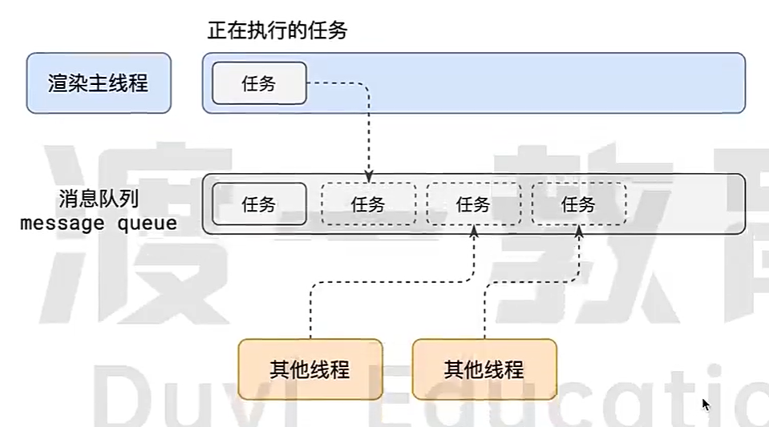

## JavaScript

### 词法作用域

作用域是指**程序源代码中定义变量的区域**。作用域规定了如何查找变量，也就是确定当前执行代码对变量的访问权限。JavaScript 采用词法作用域(lexical scoping)，也就是静态作用域。

函数的作用域在函数定义的时候就决定了

```js
var value = 1

function foo() {
  console.log(value)
}

function bar() {
  var value = 2
  foo()
}

bar() // 1
```

### 如何判断 object 为空

- `Object.keys(obj).length === 0`
- `JSON.stringify(obj) === '{}`
- `obj.hasOwnProperty() === false`
- `for-in`
- `Reflect.ownKeys(obj).length === 0` 使用反射对象的原生方法

### 异步加载 JS

```js {4,7,10}
// 延迟脚本可选.表示脚本可以延迟到文档完全被解析和显示之后再执行; 有顺序
// defer 要等到整个页面在内存中正常渲染结束（DOM 结构完全生成，以及其他脚本执行完成），才会执行（即，渲染完再执行），而且是按照 defer 脚本的声明顺序来执行脚本的
// 但 script.js 的执行要在所有元素解析完成之后，DOMContentLoaded 事件触发之前完成。
<script defer src="" type="text/javascript" />
// 异步脚本可选,表示立即下载脚本,但不妨碍页面中其他操作; 不保证按照它们的先后顺与执行
// 加载和渲染后续文档元素的过程将和 script.js 的加载与执行并行进行（异步）
<script async src="" type="text/javascript" />
// 浏览器会立即加载并执行指定的脚本，
// 立即 指的是在渲染该 script 标签之下的文档元素之前，也就是说不等待后续载入的文档元素，读到就加载并执行
<script src="" type="text/javascript" />
```

### JS 数据类型

- 原始类型: `string number boolean undefined null symbol bigint`
  - `BigInt`: 这是一种可以表示任意大的整数的数据类型。BigInt 类型的数值在其末尾加 n
  - `null`: 这是一个表示无值或无对象的特殊值。它只有一个值，即 null
  - `undefined`: 表示未定义或未赋值的值。它只有一个值，即 undefined
  - `Symbol`: 这是一种唯一且不可变的数据类型，经常用作对象属性的键; 不可枚举; 用作属性名
  - `number`: 是浮点类型的
- 对象类型: `Object`

原始类型存储的是值, 没有函数可以调用; 对象类型存储的是地址(指针)

```js
function test(person) {
  person.age = 26
  person = {
    name: "yyy",
    age: 30,
  }

  return person
}
const p1 = {
  name: "yck",
  age: 25,
}
const p2 = test(p1)
console.log(p1) // {name: 'yck', age: 26}
console.log(p2) // {name: 'yyy', age: 30}
```

### 为什么 `0.1 + 0.2 != 0.3`

JS 中`number`类型包括: 浮点和整数; 浮点数采用科学技术法来表示 $(1.4 * 10^9)$

JS 所采用的`IEEE 754`是二进制浮点数的算术标准, 这个标准里规定了 4 种浮点数算术方式, 这里选择 `float64`, 有 `64位 bit`, 包含了`一个比特符号位, 11个比特的有偏指数, 52个比特小数位`

十进制转化为二进制的算法是用十进制的小数乘以 2 直到没有了小数为止，所以十进制下的有些小数无法被精确地表示成二进制小数。而既然这里的浮点数是二进制，因此小数就会存在`精度丢失的问题`。

当我们使用加减法的时候，由于需要先对齐（也就是把指数对齐，过程中产生移位），再计算，所以这个精度会进一步丢失

### null undefined 区别

- `null` 是一个表示"无"的对象(空对象指针), 转为数值为 0
  - null 是原型链的顶层: 所有对象都继承自 Object 原型对象, Object 原型对象的原型是 null
- `undefiend` 是一个表示"无"的原始值, 转为数值为 NaN
  - 当声明了一个变量但未初始化它时，它的值为 undefined
  - 当访问对象属性或数组元素中不存在的属性或索引时，也会返回 undefined
  - 当函数没有返回值时，默认返回 undefined
  - 如果函数的参数没有传递或没有被提供值，函数内的对应参数的值为 undefined

### 立即执行函数

- 可以形成一个作用域,和全局隔开,不会污染全局
- 另一方面也是防止命名冲突的影响

```js
!(function () {
  console.log("我是立即执行函数")
})()
```

### == 和 ===

- `==` 比较的是值, 类型会隐式转换, `别用这个, 一直使用全等`
  1. 首先判断两者类型是否相同, 相同就比大小
  2. 类型不同, 进行类型转换
  3. 先判断是否在对比 null 和 undefiend, 是的话就返回 true
  4. 判断两者类型是否为 string 和 number, 是的就将字符串转换为 number
  5. 判断其中一方是否为 boolean, 是的话把 boolean 转换为 number, 在判断
  6. 判断其中一方是否为 object 且另一方为 string、number 或者 symbol，是的话就会把 object 转为原始类型再进行判断
- `===` 比较的值和类型都相等

```js
/**
 * 1. [] == false
 * 2. [] == 0
 * 3. "" == 0
 * 4. 0 == 0
 */
console.log([] == ![]) // true

const a = {
  i: 1,
  valueOf: function () {
    return this.i++
  },
}
if (a == 1 && a == 2 && a == 3) {
  console.log("Hello World!")
}
```

### 类型转换


1. 转 Boolean

在条件判断时，除了 `undefined， null， false， NaN， ''， 0， -0`，其他所有值都转为 true，包括所有对象。

2. 对象转原始类型

对象在转换类型的时候，会调用内置的 `[[ToPrimitive]]` 函数，对于该函数来说，算法逻辑一般来说如下

- 如果已经是原始类型了，那就不需要转换了
- 调用 x.valueOf()，如果转换为基础类型，就返回转换的值
- 调用 x.toString()，如果转换为基础类型，就返回转换的值
- 如果都没有返回原始类型，就会报错

3. 四则运算符

加法运算符不同于其他几个运算符，它有以下几个特点

- 运算中其中一方为字符串，那么就会把另一方也转换为字符串
- 如果一方不是字符串或者数字，那么会将它转换为数字或者字符串

```js
// 触发特点一，所以将数字 1 转换为字符串，得到结果 '11'
1 + "1" // '11'
// 触发特点二，所以将 true 转为数字 1
true + true // 2
// 触发特点二，所以将数组通过 toString 转为字符串 1,2,3，得到结果 41,2,3
4 + [1, 2, 3] // "41,2,3"

// + 'b' 等于 NaN，所以结果为 "aNaN"
"a" + +"b" // -> "aNaN"

// 除了加法的运算符来说，只要其中一方是数字，那么另一方就会被转为数字
4 * "3" // 12
4 * [] // 0
4 * [1, 2] // NaN
```

### typeof instanceof 的作用和区别

- 作用都是类型识别
- `typeof` 操作符
  - 可以识别原始类型(null 除外)
  - 不能识别具体的对象类型(function 除外)
- `instanceof`
  - 能够识别对象类型
  - 不能识别原始类型

```js
typeof "1" // 'string'
typeof 1 // "number"
typeof true // "boolean"
typeof undefined // "undefined"
typeof null // "object"
[] instanceof Array // true
```

```js
// 内部机制是通过判断对象的原型链中是不是能找到类型的 `prototype`
function myInstanceof(left, right) {
  // 首先获取类型的原型
  let prototype = right.prototype
  // 然后获得对象的原型
  left = left.__proto__
  // 然后一直循环判断对象的原型是否等于类型的原型，直到对象原型为 null，因为原型链最终为 null
  while (true) {
    if (left === null || left === undefined) return false
    if (prototype === left) return true
    left = left.__proto__
  }
}
```

### void 0 和 undefined

- `undefined` 是一种数据类型, 唯一值 `undefined`, 声明一个变量但不赋值, 就是 `undefined`, 可以被重新赋值
- `void运算` 是 js 的一种运算符, 评估一个表达式但不返回值 `void(0) void 0 void(null)` 都会返回`undefined`, 任何情况都会返回 undefiend, 更安全

### JS 作用域(链)

什么是作用域链?

作用域链是 JavaScript 中用于查找变量的一种机制，它是由一系列嵌套的作用域对象构成的链式结构，每个作用域对象包含了在该作用域中声明的变量以及对外部作用域的引用，目的是确定在给定的执行上下文中如何查找变量。当您引用一个变量时，JavaScript 引擎会首先在当前作用域对象中查找该变量，如果找不到，它会沿着作用域链向上查找，直到找到该变量或达到全局作用域，如果变量在全局作用域中也找不到，将抛出一个引用错误

使用闭包可以延长作用域链

- 全局作用域和函数作用域
- ES6 引入 `let const` 关键字定义的变量具有块级作用域, 在 `{}`（花括号）内部定义的变量只能在该块内访问，超出该块则无法访问
- 作用域链: 内部可以访问外部作用域; 外部不能访问内部作用域;
- 就近原则
- 优先级: `声明变量 > 声明普通函数 > 参数 > 变量提升`
- 注意: JS 有变量提升 `var`
  1. 先看本层作用域有没有此变量 `注意变量提升`
  2. 有函数作用域, 没有 if 等作用域

```js
window.a = 10
function fun(a) {
  console.log(a) // function a() {}
  var a = 10
  function a() {}
}
fun(100)
```

### JS 对象

- 对象是通过 `new` 操作符构建的, 对象间不相等
- 对象是引用类型, 引用类型 => 变量存储的是地址, 地址指向实际的值
- 对象的 key 都是字符串类型 (或者 symbol)
- 对象查找属性|方法: 对象本身找 -> 构造函数中找 -> 对象原型中找 -> 构造函数原型中找 -> 对象上一层原型 (原型链)

```js
console.log([1, 2, 3] === [1, 2, 3]) // false
```

### new 操作符做了什么

1. 新生成一个空对象
2. 将空对象的原型, 指向于构造函数的原型
3. 将空对象作为构造函数的上下文(改变 this 指向)
4. 对构造函数有返回值的处理判断

```js
function create(fn, ...args) {
  const obj = {} // 创建空对象
  // obj.__proto__ = fn.prototype
  Object.setPrototypeOf(obj, fn.prototype) // 空对象的原型 指向fn的原型
  // 使用apply，改变构造函数的this指向，使其指向新对象，这样，obj就可以访问到构造函数中的属性了
  const result = fn.apply(this, args)
  return result instanceof Object ? result : obj
}
```

### call apply bind 的区别

- `call | apply | bind` 都是为了改变函数体内部 this 的指向
- `call | apply` 接收的参数不同, apply 第二个参数接收数组
- `bind()`方法会创建一个新函数，称为绑定函数，当调用这个绑定函数时，绑定函数会以创建它时传入 bind()方法的第一个参数作为 this
- bind 是返回对应函数，便于稍后调用; apply 、call 则是立即调用

### JS 函数

函数是什么?

编程里子程序: 一个或多个语句组成完成特点任务 相对独立

- 函数: 有返回值
- 过程: 无返回值
- 方法: 类或对象中

JS 中, 函数都有返回值, 只有函数或方法, 返回值由什么确定

- `调用时`输入的参数 params
- `定义时`的环境 env

```js
let x = "x"
let a = "1"
function f1(x) {
  return x + a
}

{
  let a = "2"
  f1("x") // 值为多少? x1
}

// a 是定义时的 a, 不是执行时的 a
```

### JS 闭包

函数 A 内部有一个函数 B，函数 B 可以访问到函数 A 中的变量，那么函数 B 就是闭包。

如果在函数里面可以访问外面的变量, 那么 `这个函数 + 这些变量 = 闭包`

- 闭包是指有权访问另外一个函数作用域中的变量的函数; 闭包让开发者可以`从内部函数访问外部函数的作用域`
- 闭包特点
  - 能够让一个函数维持一个变量; 但并不能维持这个变量的值; 尤其变量的值会变化的时候
- 保护函数的私有变量不受外部的干扰
- 可以实现方法和属性的私有化
  - 函数作为返回值; 作为参数传递
- 闭包里面的变量会在内存, 不被及时销毁, 造成内存损耗

  - 解决方法是，在退出函数之前，将不使用的局部变量全部删除

- 优点: 保护变量, 避免全局污染; 可以创建私有变量, 实现模块化的封装和隐藏;
- 缺点: 内存占用; 性能损耗, 设计作用域链的查找, 带来一定的性能损耗

```js{2,4}
function init() {
  var name = "Mozilla"; // name 是一个被 init 创建的局部变量
  function displayName() {
    // displayName() 是内部函数，一个闭包
    alert(name); // 使用了父函数中声明的变量
  }
  displayName();
}
init();

// 使用闭包解决 for 循环打印同一个值
var list = document.getElementsByTagName("li")
for(var i = 0; i < list.length; i++) {
  (function(i) {
    list[i].onClick = () => alert(i)
  })(i)
}
```

### 什么是内存泄露

内存泄漏是指应用程序中的内存不再被使用但仍然被占用，导致内存消耗逐渐增加，最终可能导致应用程序性能下降或崩溃。内存泄漏通常是由于开发者编写的代码未正确释放不再需要的对象或数据而导致的

案例:

1. 意外的全局变量
2. 闭包: 闭包可能会无意中持有对不再需要的变量或对象的引用，从而阻止它们被垃圾回收
3. 事件监听器: 忘记移除事件监听器可能会导致内存泄漏，因为与监听器相关联的对象将无法被垃圾回收
4. 循环引用: 对象之间的循环引用会阻止它们被垃圾回收
5. setTimeout/setInterval: 使用 setTimeout 或 setInterval 时，如果没有正确清理，可能会导致内存泄漏，特别是当回调函数持有对大型对象的引用时

### this

- this 是参数, 就是一个隐式参数而已, 是 call 的第一个参数
- new 重新设计了 this
- 箭头函数不接受 this
  - 箭头函数其实是没有 this 的，箭头函数中的 this 只取决包裹箭头函数的第一个普通函数的 this
- 调用了才能确定 this, 不调用就不知道 this 指向

```js
// 显式 this
fn.call(asThis, 1, 2)
fn.bind(asThis, 1, 2)()
fn.method.call(obj, "hi")

// 隐式 this, js 自动传 this, this 指向
fn(1, 2) // => fn.call(undefined, 1, 2)
obj.method("hi") // => obj.method.call(obj, 'hi')
array[0]("hi") // array[0].call(array, 'hi')

let length = 10
function fn() {
  console.log(this.length)
}

// this 题目
let obj = {
  length: 5,
  method(fn) {
    fn() // fn.call(undefined) window.length 和 let length 没有关系; window.length 和当前 iframe 有关
    arguments[0] // arguments.0.call(arguments) fn.call(arguments) 2 arguments 实参的长度
  },
}
obj.method(fn, 1)
```

### 柯里化 Currying

让所有函数只接受一个参数, 那么怎么支持两个参数

```js
const add = ({a, b} => a + b) // 用对象实现
add({a: 1, b: 2})

const add = a => b => a + b // 用闭包实现
add(1)(2)
```

柯里化一个函数: 把多参数函数, 变成单参数函数

```js
// 题目1: 三参数函数 add(1, 2, 3) 变成 curriedAdd(1)(2)(3)
cosnt curriedArr =
  a =>
    b =>
      c =>
        add(a, b, c)

// 题目2: 对1的升级
/**
 * addTwo 接受两个参数
 * addThree 接受三个参数
 * addFour 接受四个参数
 * 写出一个 currify 函数, 使得他们分别接受 2 3 4 次参数, 比如:
 * currify(addTwo)(1)(2) // 3
 * currify(addThree)(1)(2)(3) // 6
 * currify(addFour)(1)(2)(3)(4) // 10
 */
const addTwo = (a, b) => a + b
const addThree = (a, b, c) => a + b + c
const addFour = (a, b, c, d) => a + b + c + d
const currify = (fn, params = []) => {
  return (arg) => {
    const newParams = params.concat(arg)
    if(newParams.length === fn.length) {
      return fn(...newParams)
    } else {
      return currify(fn, newParams)
    }
  }
}

const currify = (fn, params = []) => {
  // 支持多个参数
  return (...args) => {
    if(params.length + args.length === fn.length) {
      return fn(...params, ...args)
    } else {
      return currify(fn, [...params, ...args])
    }
  }
}
```

### 高阶函数

把`函数作为参数`或者`返回值的函数`

JS 内置的高阶函数

- Function.prototype.bind
- Function.prototype.apply
- Function.prototype.call
- Array.prototype.sort
- Array.prototype.map
- etc.

```js
// 理解 js call 才能真正理解 js
// 推理
const bind = Function.prototype.bind
const f1 = function () {
  console.log("this")
  console.log(this)
  console.log("arguments")
  console.log(arguments)
}

const newF1 = f1.bind({ name: "yym" }, 1, 2, 3)

// 1. 假设我认同 obj.method(a) => obj.method.call(obj, a)
// 2. obj = f1; method = bind
const newF1 = f1.bind.call(f1)

// 3. 带入参数 a = {name: 'yym'} b,c,d = 1, 2, 3
/**
 * f1
 * this = {name: 'yym'}
 * arguments = [1, 2, 3]
 */
const newF1 = f1.bind.call(f1, { name: "yym" }, 1, 2, 3)

// f1.bind === Function.prototype.bind
// const bind = Function.prototype.bind
// 上面两句 f1.bind === bind
// f1.bind.call(f1, {name: 'yym'}, 1, 2, 3)

/**
 * 接受一个函数, this, 其它参数
 * 返回一个新的函数, 会调用 fn, 并传入 this 和其它参数
 */
bind.call(f1, { name: "yym" }, 1, 2, 3)
```

### JS 原型链

- 理解原型对象: 无论什么时候,只要创建了新函数, 就会有一组特定的规则为该函数创建一个 prototype 属性, 这个属性指向函数的原型对象, 默认情况下, 所有原型对象都会自动获得一个 constructor(构造函数)属性, 这个属性是指向 prototype 属性所在的指针
- 原型: 对象可以共享属性和方法
- 实例化对象原型`__proto__`指向构造函数的`prototype`属性; `prototype`是函数才有的属性，而`__proto__`是每个对象都有的属性
- 什么是原型链?
  - 每个构造函数都有原型对象,每个对象都会有构造函数,每个构造函数的原型都是一个对象,那么这个原型对象也会有构造函数;
  - 那么这个原型对象的构造函数也会有原型对象; 这样就会形成一个链式的结构，称为原型链.

```js
arr.__proto__ === Array.prototype

function Person(name) {
  this.name = name
}
Person.prototype.sayName = function () {
  console.log("My name is :" + this.name)
}
// p 实例化对象原型 __proto__ 指向 Person 的 prototype 属性
var p = new Person("Hello")
p.sayName()
```

```js
/**
 * 原型继承: 子类的原型对象指向父类实例，当子类实例找不到对应的属性和方法时，就会往它的原型对象，也就是父类实例上找，从而实现对父类的属性和方法的继承
 * 缺点:
 * 1. 所有Child实例原型都指向同一个Parent实例, 因此对某个Child实例的父类引用类型变量修改会影响所有的Child实例
 * 2. 创建子类实例时无法向父类构造传参, 即没有实现super()的功能
 */
function Parent() {
  this.name = "yym"
}
Parent.prototype.getName = function () {
  return this.name
}

function Child() {}

// 子类原型对象指向父类实例, 这样一来在Child实例中找不到的属性和方法就会到原型对象(父类实例)上寻找
Child.prototype = new Parent()
Child.prototype.constructor = Child

const child = new Child()
child.name
child.getName()
```

```js
/**
 * 构造函数继承: 构造函数继承，即在子类的构造函数中执行父类的构造函数，让父类的构造函数把成员属性和方法都挂到子类的this上去，这样既能避免实例之间共享一个原型实例，又能向父类构造方法传参
 * 缺点: 继承不到父类原型上的属性和方法
 */

function Parent(name) {
  this.name = [name]
}
Parent.prototype.getName = function () {
  return this.name
}

function Child() {
  Parent.call(this, "yym") // // 执行父类构造方法并绑定子类的this, 使得父类中的属性能够赋到子类的this上
}

//测试
const child1 = new Child()
const child2 = new Child()
child1.name[0] = "foo"
console.log(child1.name) // ['foo']
console.log(child2.name) // ['zhangsan']
child2.getName() // 报错,找不到getName(), 构造函数继承的方式继承不到父类原型上的属性和方法
```

```js
/**
 * 组合继承: 综合上面两种优势
 * 缺点: 创建子类实例都执行了两次构造函数(Parent.call()和new Parent())，虽然这并不影响对父类的继承，但子类创建实例时，原型中会存在两份相同的属性和方法
 */
function Person(name) {
  this.name = name
}
Person.prototype.sayName = function () {
  console.log(`${this.name}你好`)
}

function People(name) {
  // 继承属性
  Person.call(this, name)
}
// 原型链继承
People.prototype = new Person()
People.prototype.construtor = People

const people = new People("yym")
people.sayName()
```

```js
/**
 * 寄生式组合继承: 为了解决构造函数被执行两次的问题, 将指向父类实例改为指向父类原型, 减去一次构造函数的执行
 */
function Parent(name) {
  this.name = [name]
}
Parent.prototype.getName = function () {
  return this.name
}
function Child() {
  // 构造函数继承
  Parent.call(this, "zhangsan")
}
Child.prototype = Object.create(Parent.prototype) //将`指向父类实例`改为`指向父类原型`
Child.prototype.construtor = Child

//测试
const child1 = new Child()
const child2 = new Child()
child1.name[0] = "foo"
console.log(child1.name) // ['foo']
console.log(child2.name) // ['zhangsan']
child2.getName() // ['zhangsan']
```

### target 和 currentTarget

- `e.target`：**触发**事件的元素
- `e.currentTarget`：**绑定**事件的元素

```html
<div id="a">
  <div id="b">
    <div id="c">
      <div id="d">哈哈哈哈哈</div>
    </div>
  </div>
</div>
```

```js
a.addEventListener('click', (e) => {
  const {
    target,
    currentTarget
  } = e
  console.log(`target是${target.id}`)
  console.log(`currentTarget是${currentTarget.id}`)
})
b.addEventListener('click', (e) => {
  ...
})
c.addEventListener('click', (e) => {
  ...
})
d.addEventListener('click', (e) => {
  ...
})
```

addEventListener 第三个参数为 false，表示冒泡：

```js
target是d currentTarget是d
target是d currentTarget是c
target是d currentTarget是b
target是d currentTarget是a
```

为 true，表示捕获：

```js
target是d currentTarget是a
target是d currentTarget是b
target是d currentTarget是c
target是d currentTarget是d
```

### 判断变量是不是数组

- `Array.isArray()`
- `instanceof` => `arr instanceof Array`
- `Object.prototype.toString.call(arr)`
- etc.

### JS sort()

- 对于数组的元素进行排序, 返回数组, 默认排序顺序根据字符串 `Unicode` 码点
- V8 引擎 sort 函数, 数量小于 10 使用 `InsertSort`, 大于 10 使用 `QuickSort`

```js
const arr = [1,2,34, 5, 5, '34', '35']
arr.sort()
arr.sort(function(a,b) => {
  return a - b
})
```

### 深拷贝和浅拷贝

1. 浅拷贝: 只复制引用, 未复制真正的值
2. 深拷贝: 复制真正的值

```js
// 浅拷贝
const arr = [1, 2, 3]
const arr1 = arr
const obj = { a: 1, b: 2 }
const obj1 = Object.assign(obj)
const obj2 = { ...obj } // 展开运算符

// 深拷贝 JSON
/**
 * 会忽略 undefined
 * 会忽略 symbol
 * 不能序列化函数
 * 不能解决循环引用的对象
 */
const obj2 = JSON.parse(JSON.stringify(obj))

// 我想要真正的值: 把源数据的每个值放到新的变量中
const newObj = {}
newObj[key] = obj[key]
```

### cookie 和 session

1. cookie 存储在浏览器端; session 存储在服务端;
2. cookie 以明文的方式存放在客户端, 安全性较低; session 存在于服务器中, 安全性较好
3. cookie 设置内容过多会增大报文体积, 影响传输效率; session 数据存储在服务器, 通过 cookie 传递 id, 不影响效率
4. 浏览器限制单个 cookie 保存数据不能超过 4k; session 存储在服务器无限制

### cookie localStorage sessionStorage

1. 都是在客户端存储数据
2. 有效期: local 持久化存储; session 浏览器关闭之前有效; cookie 可以设置过期时间
3. 大小: cookie 只有 4k; 其它两个存储 5M

### forEach 和 map 的区别？foreach 为什么不能使用 break，continue 和 return 打断？那怎么打断 forEach 的循环？

1. forEach 没有返回值, 返回 undefined; 回调函数里面使用 break 肯定是非法的，因为 break 只能用于跳出循环，而我们的回调函数不是循环体
2. map 返回一个新的数组; 可以继续链接其它数组方法
3. 通过 `try-catch抛出异常` 来跳出循环

```js
let arr = [1, 2, 3, 4, 5, 6, 7, 8, 9]
let num = 6
try {
  arr.forEach((item, i) => {
    console.log("item", item)
    if (item === num) {
      throw new Error("LoopInterrupt") //满足条件，跳出循环
    }
  })
} catch (e) {
  if (e.message !== "LoopInterrupt") throw e
}
console.log(123)
```

### 如何遍历对象

```js
// for in
const obj = { a: 1, b: 2, c: 3 }
for (let key in obj) {
  console.log(key, obj[key])
}

// Object.keys
const keys = Object.keys(obj)

// Object.entries
const entries = Object.entries(obj)

// Reflect.ownKeys
Reflect.ownKeys(obj)
```

### 宿主对象 内置对象 原生对象

宿主对象是由宿主环境（通常是浏览器或 Node.js）提供的对象。它们不属于 JavaScript 的核心，而是根据运行环境提供的功能而存在。宿主对象可以包括

- window, document, XMLHttpRequest
- global process

内置对象是 JavaScript 语言本身提供的对象，它们包含在 JavaScript 的标准规范

- 全局对象, Math, Date Regexp

原生对象是 JavaScript 语言的一部分，但它们不是内置对象。原生对象是通过构造函数或字面量方式创建的对象，例如数组、字符串、函数、对象等

```js
const arr = [1, 2, 3] // 创建数组对象​
const func = function () {} // 创建函数对象​
const obj = { key: "value" } // 创建对象
```

### 什么是类数组, 转化为真是的数组

类数组是一种类似数组的对象, 它们具有类似数组的结构, 具有数字索引和 length 属性, 但不具有数组对象上的方法和功能

- 函数的 argumengts 对象
- DOM 元素列表 (querySelectorAll 获取的元素集合)
- 一些内置方法 (getElementsByTagName) 返回的集合

```js
Array.from(nodeList)

Array.prototype.slice.call(nodeList)

[...nodeList] // 扩展运算符
```

### Ajax 避免浏览器缓存方法

```js
// 1. 添加时间戳或随机参数
var timestamp = new Date().getTime();
var url = 'data.json?timestamp=' + timestamp;

// 2. 禁用缓存头信息
var xhr = new XMLHttpRequest();
xhr.open('GET', 'data.json', true);
xhr.setRequestHeader('Cache-Control', 'no-cache');
xhr.send()

// 3. 设置响应头：服务器可以在响应头中设置缓存控制信息，以告诉浏览器不要缓存响应
Cache-Control: no-cache, no-store, must-revalidate
Pragma: no-cache
Expires: 0

// 4. 使用 POST 请求：
```

### eval 的功能和危害

eval 是 JavaScript 中的一个全局函数，用于将包含 JavaScript 代码的字符串作为参数，并执行该代码; 动态执行字符串中的 JavaScript 代码，可以在运行时生成 JavaScript 代码并执行它

- 安全风险: 它允许执行来自不受信任的来源的代码
- 性能问题: 它需要在运行时解析和执行代码
- 可读性问题

### JS 监听对象属性的改变

```js
const person = {
  firstName: 'John',
  lastName: 'Doe'
}

Object.defineProperty(person, 'firstName', {
  get() {
    return this._firstName
  }
  set(value) {
    this._firstName = value
  }
  configureable: true
})
const handle = {
  get(target, property) {
    return target[property]
  },
  set(target, property, value) {
    target[property] = value
    return true
  }
}

const proxyPerson = new Proxy(person, handle)
```

## ES6+

- `let const` 块级作用域的变量
- 箭头函数
- 模板字符串
- 解构赋值
- 类和模块 `class import`
- `Promise async await`
- `Array.prototype.includes() .flat() .flatMap()`
- `Object.values()  Object.entries()`
- 对象的扩展运算符 `...`
- 可选连操作符 `??`

### var let const

- 都可以声明变量
- `var`
  - 在全局作用域下声明变量会导致变量挂载在 `window` 上
  - 声明的变量会发生提升, 函数提升优先于变量提升，函数提升会把整个函数挪到作用域顶部，变量提升只会把声明挪到作用域顶部
- `let/const`
  - 声明的全局变量不会被挂载到 `window` 上; 会在 Script 作用域下
  - let/const 声明的变量不会提升
  - 同级作用域下不能重复声明
  - 暂时性死区，我们不能在声明前就使用变量; let 声明之前的执行瞬间被称为 “暂时性死区”，此阶段引用任何后面声明的变量会抛出 ReferenceError 错误
- `var/let` 声明的变量可以再次赋值; `const` 常量不能重新赋值
- `let/const` 有块作用域; `var` 没有自己的作用域

### 普通函数和箭头函数

所谓的没有 this，不是箭头函数中没有 this 这个变量，而是箭头函数不绑定自己的 this，它们会捕获其所在上下文的 this 值，作为自己的 this 值。这对于回调函数特别有用，可以避免传统函数中常见的 this 指向问题。例如，在对象方法中使用箭头函数可以确保 this 保持一致

1. this 指向的问题
   - 箭头函数的 this 是在箭头函数定义时就决定的, 而且不可修改; 指向定义时, 外层第一个普通函数 this
2. 箭头函数不能 `new`
3. 箭头函数没有原型 `prototype`
4. 箭头函数没有 `arguments`

```js
globalThis.a = 100
function fn() {
  return {
    a: 200,
    m: function () {
      console.log(this.a)
    },
    n: () => {
      console.log(this.a)
    },
    k: function () {
      return function () {
        console.log(this.a)
      }
    },
  }
}

const fn0 = fn()
fn0.m() // 输出 200，this 指向 {a, m, n}
fn0.n() // 输出 100，this 指向 globalThis
fn0.k()() // 输出 100, this 指向 globalThis

const context = { a: 300 }
const fn1 = fn.call(context) // 改变箭头函数 this 指向
fn1.m() // 输出 200，this 指向 {a, m, n}
fn1.n() // 输出 300，this 指向 context
fn1.k().call(context) // 输出 300，this 指向 context
```

### find filter some every

- find 返回符合条件的第一个元素, 查找
- filter 返回新数组, 过滤
- some 元素里只要有一个元素满足条件为真, 就返回 true
- every 元素里所有元素都满足条件采薇真, 返回 true
- map 作用是生成一个新数组，遍历原数组，将每个元素拿出来做一些变换然后放入到新的数组中
- reduce 来说，它接受两个参数，分别是回调函数和初始值

```js
/**
 * parseInt('1', 0) -> 1
 * parseInt('2', 1) -> NaN
 * parseInt('3', 2) -> NaN
 */
console.log(["1", "2", "3"].map(parseInt))
```

### Event Loop 事件循环

#### 进程和线程

- 程序运行需要有它自己专属的内存空间, 可以把这块内存空间简单的理解为进程
- 每个应用至少有一个进程, 进程之间相互独立, 既使要通信, 也需要双方同意
- 一个进程至少有一个线程, 所以在进程开启会自动创建一个线程来运行代码, 该线程称之为主线程
- 进程描述了 CPU 在运行指令及加载和保存上下文所需的时间，放在应用上来说就代表了一个程序
- 线程是进程中的更小单位，描述了执行一段指令所需的时间。

浏览器有哪些进程和线程?

浏览器是一个`多进程多线程`的应用程序, 最主要的进程有:

1. 浏览器进程: 主要负责界面显示、用户交互、子进程管理等, 浏览器进程内部会启动多个线程处理不同的任务
2. 网络进程: 负责加载网络资源, 网络进程内部会启动多个线程来处理不同的网络任务
3. 渲染进程
   1. 渲染进程启动后, 会开启一个`渲染主线程`, 主线程负责执行 `HTML CSS JS` 代码
   2. 默认情况下, 浏览器会为每个标签页开启一个新的渲染进程, 保证不用标签页之间不相互影响

**渲染主线程是如何工作的?**

渲染主线程是浏览器最繁忙的线程, 需要他处理的任务包括但不限于:

- 解析 HTML
- 解析 CSS
- 计算样式
- 布局
- 处理图层
- 每秒把页面画 60 次
- 执行全局 js 代码
- 执行事件处理函数
- 执行计时器的回调函数
- ...

处理那么多的任务, 如何调度任务? **排队**



1. 在最开始的时候,渲染主线程会进入一个无限循环(轮询)
2. 每一次循环会检查消息队列中是否有任务存在, 有就取出第一个任务执行, 执行完进入下一次循环; 如果没有, 则进入休眠状态
3. 其他所有线程可以随时向消息队列添加任务. 新任务会加到消息队列的末尾. 在添加任务时, 如果主线程是休眠状态, 则会唤醒继续循环拿取任务
4. 整个过程, 称为事件循环(消息循环)

**何为异步?**

代码在执行过程中, 会遇到一些无法立即处理的任务, 比如:

- 计时完成后需要执行的任务 `setTimeout setInterval`
- 网络通信完成后需要执行的任务 `XHR Fetch`
- 用户操作后需要执行的任务 `addEventListener`

如果让渲染主线程等待这些任务的时机达到, 就会导致主线程长期处于`阻塞`的状态, 导致浏览器`卡死`


使用异步的方式


#### 如何理解 JS 的异步

> JS 是一门单线程的语言，这是因为它运行在浏览器的渲染主线程中，而渲染主线程只有一个。而渲染主线程承担着诸多的工作，渲染页面、执行 JS 都在其中运行。

> 如果使用同步的方式，就极有可能导致主线程产生阻塞，从而导致消息队列中的很多其他任务无法得到执行。这样一来，一方面会导致繁忙的主线程白白的消耗时间，另一方面导致页面无法及时更新，给用户造成卡死现象。

> 所以浏览器采用异步的方式来避免。具体做法是当某些任务发生时，比如计时器、网络、事件监听，主线程将任务交给其他线程去处理，自身立即结束任务的执行，转而执行后续代码。当其他线程完成时，将事先传递的回调函数包装成任务，加入到消息队列的未尾排队，等待主线程调度执行。

> 在这种异步模式下，浏览器永不阻塞，从征最大限度的保证了单线程的流畅运行。

#### 任务有优先级吗?

任务没有优先级, 在消息队列中先进先出. **但消息队列有优先级**

W3C 最新解释:

- 每个任务都有一个任务类型，同一个类型的任务必须在一个队列，不同类型的任务可以分属于不同的队列。在一次事件循环中，浏览器可以根据实际情况从不同的队列中取出任务执行。
- 浏览器必须准备好一个微队列(microtask), 微队列中的任务优先所有其他任务执行

在目前 chrome 的实现中，至少包含了下面的队列:

- 延时队列: 用于存放计时器到达后的回调任务，优先级「中」
- 交互队列: 用于存放用户操作后产生的事件处理任务，优先级「高」
- 微队列: 用户存放需要最快执行的任务，优先级「最高」

#### 阐述一下 JS 的事件循环

JS 的事件循环又叫消息循环, 是浏览器渲染主线程的工作方式.

在 Chrome 的源码中, 它开启一个不会结束的 for 循环, 每次循环从消息队列中取出第一个任务执行, 而其他线程只需要在合适的时候将任务加入到队列末尾即可

过去把消息队列简单的分为宏队列和微队列, 这种说法无法满足复杂的浏览器环境, 取而代之的是一种更加灵活多变的处理方式

根据 3C 官方的解释，每个任务有不同的类型，同类型的任务必须在同一个队列，不同的任务可以属于不同的队列。不同任务队列有不同的优先级，在一次事件循环中，由浏览器自行决定取哪一个队列的任务。但浏览器必须有一个微队列，微队列的任务一定具有最高的优先级，必须优先调度执行。

#### JS 中的计时器能做到精确计时吗? 为什么?

不能

1. 计算机硬件没有原子钟, 无法做到精确计时
2. 操作系统的计时函数本身就有少量偏差，由于 JS 的计时器最终调用的是操作系统的函数，也就携带了这些偏差
3. 按照 W3C 的标准，浏览器实现计时器时，如果嵌套层级超过 5 层，则会带有 4 毫秒的最少时间，这样在计时时间少于 4 毫秒时又带来了偏差
4. 受事件循环的影响，计时器的回调函数只能在主线程空闲时运行，因此又带来了偏差

#### 执行栈

可以把执行栈认为是一个存储函数调用的栈结构，遵循先进后出的原则。

#### 浏览器中的 Event Loop

当遇到异步的代码时，会被挂起并在需要执行的时候加入到 Task（有多种 Task） 队列中。一旦执行栈为空，Event Loop 就会从 Task 队列中拿出需要执行的代码并放入执行栈中执行，所以本质上来说 JS 中的异步还是同步行为


不同的任务源会被分配到不同的 Task 队列中，任务源可以分为 微任务（microtask） 和 宏任务（macrotask）。在 ES6 规范中，microtask 称为 jobs，macrotask 称为 task。

```js
console.log("script start") // 1

async function async1() {
  await async2()
  console.log("async1 end") //5
}
async function async2() {
  console.log("async2 end") // 2
}
async1()

setTimeout(function () {
  console.log("setTimeout") // 8
}, 0)

new Promise((resolve) => {
  console.log("Promise") // 3
  resolve()
})
  .then(function () {
    console.log("promise1") // 6
  })
  .then(function () {
    console.log("promise2") // 7
  })

console.log("script end") // 4
```

#### Node 中的 Event Loop

Eventloop: 状态变化的过程, 有哪几个阶段? 最后一个阶段再回到第一个阶段, 事件循环

1. timers
2. I/O callbacks
3. prepare
4. poll
5. check
6. close cb

我们只需了解

1. timer
   - timers 阶段会执行 `setTimeout 和 setInterval` 回调，并且是由 poll 阶段控制的
2. poll
   - 回到 timer 阶段执行回调
   - 执行 I/O 回调
3. check
   - check 阶段执行 `setImmediate`

`Node.js 的 EventLoop` 的几个阶段: `timers poll check`, 顺序是: timers -> poll -> check -> timers

```js
/**
 * 开启 eventloop
 * 执行 js
 *
 * 1. setTimeout 放入事件循环 timers 阶段
 * 2. poll 等待, 不到 1s 不执行 setTimeout
 * 3. check 阶段 也有个队列: setImmediate(fn)
 * 4. poll 等待看到 check 阶段有, 执行, 然后继续等待 1s 去执行 timers 阶段的 定时器
 * 5. 循环查看, 事件循环
 *
 * 大部分时间停留在 poll 阶段等待, setImmediate(fn)在check阶段, 先执行
 * */
setTimeout(fn, 1000)
setImmediate(fn2)

// process.nextTick，这个函数其实是独立于 Event Loop 之外的，它有一个自己的队列，当每个阶段完成后，如果存在 nextTick 队列，就会清空队列中的所有回调函数，并且优先于其他 microtask 执行。
process.nextTick(fn3) // 当前阶段执行 马上执行
// fn3 fn2 fn
```

**宏任务、微任务**

- MacroTask 宏任务: setTimeout 放到 timers 阶段; setImmediate -> check 阶段
- MicroTask 微任务: process.nextTick -> 当前后面立即执行; `new Promise(fn)` 马上执行; await 把后面的转化为 promise.then()

```js
async function async1() {
  console.log(1)
  await async2() // async2.then(() => {console.log(2)}) 后面的都是 then 里面的
  console.log(2)
}

async function async2() {
  console.log(3)
}

async1()

new Promise(function (resolve) {
  console.log(4)
  resolve() // 决定执行哪个函数
}).then(function () {
  console.log(5)
})

// 1 3 4 2 5
```

### Promise

是异步编程的一种解决方案, 比传统的回调函数更强大

有三种状态: `pending、fulfilled、rejected`

一旦从等待状态变成为其他状态就永远不能更改状态了

```js
new Promise(function (reslove, reject) {})

// 制造一个成功 或失败
Promise.reslove(4) // 值为 4 的 promise
// 制造一个失败
Promise.reject(result)
// 等待全部成功, 才成功
Promise.all([Promise1, Promise2, ...PromiseN])
// 等待第一个状态改变
Promise.race(数组)
```

```js
// 自己写一个 Promise.allSettled
// 无论成功失败 都返回
Promise.allSettled([Promise1, Promise2, ...PromiseN])

// 参数是 promise, 无论 promise 成功失败, 再次返回一个 promise
task = () => new Promise((reslove, reject) => ) // promise 不会立即执行
x = promise => promise.then((value) => {status: 'ok', value}, (reason) => {status: 'not ok', reason})
Promise.all([x(promise1()), x(promise2()), x(promise3())]).then(v => console.log(v))

// =>
x = promiseList => promiseList.map(
  promise => promise.then((value) => {status: 'ok', value}, (reason) => {status: 'not ok', reason})
)
Promise.all([x(promise1(), promise2(), promise3())]).then(v => console.log(v))

// =>
Promise.allSettled2 = function(promiseList) {
  return Promise.all(x(promiseList))
}
Promise.allSettled2([promise1(), promise2(), promise3()]).then(v => console.log(v))
```

**应用场景**

1. 多次处理一个结果
2. 串行: 同一个请求, 多次请求, 后面的请求比前面的请求返回结果快 任务串行
   - 保证第一个请求结果出来 再返回第二个结果
   - 把任务放进队列, 完成一个再做下一个
3. 并行
   - Promise.all
   - Promise.allSettled
4. 实际应用中, 尽量将所有异步操作进行 Promise 的封装，方便其他地方调用, 放弃以前的 callback 写法
5. 尽量将 new Promise 的操作封装在内部，而不是在业务层去实例化

**Promise 错误处理**

- `Promise.then(s1, f1)`
- `Promise.then(s1).catch(f1)`
- 尽量通过 `catch()` 去捕获 Promise 异常，需要说明的是，一旦被 catch 捕获过的异常，将不会再往外部传递，除非在 catch 中又触发了新的异常
- 如果 catch 里面在处理异常时，又发生了新的异常，将会继续往外冒，这个时候我们不可能无止尽的在后面添加 catch 来捕获，所以 Promise 有一个小的缺点就是最后一个 catch 的异常没办法捕获

### async / await

- 优点: 就像在写同步代码
- 只能和 promise 配合, 是 `promise` 语法糖
- 为了兼容旧代码 `await(promise)`, 所以官方在前面强制加了一个 `async`, 没有实际意义, 和 await 配合
- 一般通过 `async await 来配合 Promise` 使用，这样可以让代码可读性更强，彻底没有"回调"的痕迹了

```js
// 一个函数如果加上 async ，那么该函数就会返回一个 Promise
async function test() {
  return "1"
}
console.log(test()) // -> Promise {<resolved>: "1"}

const fn = async () => {
  const temp = await makePromise()
  return temp + 1
}
```

- await 错误处理

```js
// try catch 比较丑
let res
try {
  res = await axios()
} catch (err) {
  if (err) {
    throw new Error()
  }
}
```

```js
// 使用 catch 来捕获 错误

// await 只关心成功, 失败交给 catch 捕获
awiat axios.get().catch(error => {})
```

- await 传染性

```js
console.log(1)
await console.log(2)
console.log(3) // await 下面的代码 变成异步了
// promise 同样有传染性 (同步变异步)
// 回调没有传染性
```

```js
// 题目:
// 首先函数 test 先执行，在执行到 await 10 之前变量 a 还是 0，因为 await 内部实现了 generator ，generator 会保留堆栈中东西，所以这时候 a = 0 被保存了下来
let a = 0
let test = async () => {
  // 因为 await 是异步操作，后来的表达式不返回 Promise 的话，就会包装成 Promise.reslove(返回值)，然后会去执行函数外的同步代码
  a = a + (await 10) // a+  先执行 a = 0
  console.log(a) // 异步
}
test()

console.log(++a) // 同步先打 1

// 1
// 10
```

```js
// 错误写法
async function getData() {
  // await 不认识后面的 setTimeout，不知道何时返回
  const data = await setTimeout(() => {
    return
  }, 3000)

  console.log("3 秒到了")
}
```

```js
// 正确写法
async function getData() {
  const data = await new Promise((reslove) => {
    setTimeout(() => {
      return
    }, 3000)
  })

  console.log("3 秒到了")
}
```

:::tip

- await 同一行后面的内容对应 Promise 主体内容，即同步执行的
- await 下一行的内容对应 then()里面的内容，是异步执行的
- await 同一行后面应该跟着一个 Promise 对象，如果不是，需要转换（如果是常量会自动转换）
- async 函数的返回值还是一个 Promise 对象
  :::

### 模块化

- 解决命名冲突
- 提高复用性
- 提高代码可维护性

1. `立即执行函数` 通过函数作用域解决了命名冲突、污染全局作用域的问题

```js
!(function (globalVariable) {
  globalVariable.test = function () {}
  // ... 声明各种变量、函数都不会污染全局作用域
})(globalVariable)
```

2. `Common.js`: 最早在 `node` 使用

```js
// a.js
module.exports = {
  a: 1,
}
// or
exports.a = 1

// b.js
var module = require("./a.js")
module.a // -> log 1
```

3. `ES Module` 是原生实现的模块化方案

```js
// 引入模块 API
import XXX from "./a.js"
import { XXX } from "./a.js"
// 导出模块 API
export function a() {}
export default function () {}
```

### Proxy 代理

Proxy 是 ES6 中新增的功能，它可以用来自定义对象中的操作

```js
// target: 需要添加代理的对象, handler: 用来自定义对象中的操作, 比如可以用来自定义 set 或者 get 函数。
let p = new Proxy(target, handler)
```

```js
// 自定义 set 和 get 函数的方式，在原本的逻辑中插入了我们的函数逻辑，实现了在对对象任何属性进行读写时发出通知
let onWatch = (obj, setBind, getLogger) => {
  let handler = {
    get(target, property, receiver) {
      getLogger(target, property)
      return Reflect.get(target, property, receiver)
    },
    set(target, property, value, receiver) {
      setBind(value, property)
      return Reflect.set(target, property, value)
    },
  }
  return new Proxy(obj, handler)
}

let obj = { a: 1 }
let p = onWatch(
  obj,
  (v, property) => {
    console.log(`监听到属性${property}改变为${v}`)
  },
  (target, property) => {
    console.log(`'${property}' = ${target[property]}`)
  }
)
p.a = 2 // 监听到属性a改变
p.a // 'a' = 2
```

### setTimeout、setInterval、requestAnimationFrame 各有什么特点？

`setTimeout` 允许我们将函数推迟到一段时间间隔之后再执行

`setInterval`，其实这个函数作用和 setTimeout 基本一致，setInterval 允许我们重复运行一个函数，从一段时间间隔之后开始运行，之后以该时间间隔连续重复运行该函数。

`requestAnimationFrame` 自带函数节流功能，基本可以保证在 16.6 毫秒内只执行一次（不掉帧的情况下），并且该函数的延时效果是精确的，没有其他定时器时间不准的问题，当然你也可以通过该函数来实现 setTimeout。

`requestAnimationFrame`和 js 中的 setTimeout 定时器函数基本一致，不过 setTimeout 可以自由设置间隔时间，而 `requestAnimationFrame`的间隔时间是由浏览器自身决定的，大约是 17 毫秒左右

```js
let timerId = setTimeout(...);
clearTimeout(timerId);

// 嵌套的 setTimeout 相较于 setInterval 能够更精确地设置两次执行之间的延时
let timerId = setTimeout(function tick() {
  alert('tick');
  timerId = setTimeout(tick, 2000); // (*)
}, 2000);
```

### 用 setTimeout 来实现倒计时, 与 setInterval 的区别？

- setTimeout: 每隔一秒生成一个任务，等待一秒后执行，执行完成后，再生成下一个任务，等待一秒后执行，如此循环，所以左边任务间的间隔保证是 1 秒
- setInterval: 无视执行时间，每隔一秒往任务队列添加一个任务，等待一秒后执行，这样会导致任务执行间隔小于 1 秒，甚至任务堆积
- setInterval 中当任务执行时间大于任务间隔时间，会导致消费赶不上生产

```js
const countDown = (count) => {
  setTimeout(() => {
    count--
    if (count > 0) {
      countDown(count)
    }
  }, 1000)
}
countDown(10)

let count = 10
let timer = setInterval(() => {
  count--
  if (count <= 0) {
    clearInterval(timer)
    timer = null
  }
}, 1000)
```

## 杂谈

### token 可以放在 cookie 里吗？

第一时间要想到安全问题。通常回答不可以，因为存在 CSRF（跨站请求伪造）风险，攻击者可以冒用 Cookie 中的信息来发送恶意请求。解决 CSRF 问题，可以设置同源检测（Origin 和 Referer 认证），也可以设置 Samesite 为 Strict。最好嘛，就是不把 token 放在 cookie 里咯。

### 前端埋点的实现，说说看思路

对于埋点方案：一般分为手动埋点（侵入性强，和业务强关联，用于需要精确搜集并分析数据，不过该方式耗时耗力，且容易出现误差，后续要调整，成本较高）、可视化埋点（提供一个可视化的埋点控制台，只能在可视化平台已支持的页面进行埋点）、无埋点（就是全埋点，监控页面发生的一切行为，优点是前端只需要处理一次埋点脚本，不过数据量过大会产生大量的脏数据，需要后端进行数据清洗）。

埋点通常传采用 img 方式来上传，首先所有浏览器都支持 Image 对象，并且记录的过程很少出错，同时不存在跨域问题，请求 Image 也不会阻塞页面的渲染。建议使用 1\*1 像素的 GIF，其体积小。

现在的浏览器如果支持 Navigator.sendBeacon(url, data)方法，优先使用该方法来实现，它的主要作用就是用于统计数据发送到 web 服务器。当然如果不支持的话就继续使用图片的方式来上传数据

## DOM

### DOM 节点的 Attributes 和 Property 区别

Attribute 属性

- Attribute 是 HTML 元素在文档中的属性，它们通常在 HTML 中定义，并被存储在 HTML 元素的开始标签中
- Attribute 可以包含在 HTML 中，如 `<div id="myDiv" class="container">` 中的 id 和 class
- Attribute 始终是字符串值，无论它们在 HTML 中是什么数据类型
- 通过 getAttribute() 方法可以访问元素的属性值，例如 element.getAttribute("id")

Property（属性）

- Property 是 DOM 元素对象的属性，它们通常表示了 HTML 元素在文档中的状态和属性
- Property 的值可以是不同的数据类型，取决于属性的类型
- 通过访问 DOM 元素对象的属性，可以直接操作和修改元素的状态，例如 element.id 或 element.className

总结

- Attribute 是 HTML 标记中的属性，它们以字符串形式存储在 HTML 元素的标记中
- Property 是 DOM 元素对象的属性，它们表示了元素在文档中的状态和属性，可以是不同的数据类型。
- Attribute 始终是字符串，而 Property 的数据类型可以更广泛

### 常见 DOM 操作

```js
// 创建新元素节点
const newElement = document.createElement("div")
// 创建文本节点
const textNode = document.createTextNode("Hello, World")
// 创建文档片段
const fragment = document.createDocumentFragment()

// 添加为子节点
parentElement.appendChild(newElement)
// 在参考节点之前插入
parentElement.insertBefore(newElement, referenceElement)

// 从父节点中移除子节点
parentElement.removeChild(childElement)

// 移动节点到新位置
newParentElement.appendChild(childElement)

// 复制节点
const clone = originalNode.cloneNode(true)

// 通过 id 查找元素
const element = document.getElementById("myElement")
// 使用 CSS 选择器查找元素
const element = document.querySelector(".myClass")
// 使用节点遍历方法查找节点
const firstChild = parentElement.firstChild
```

### DOM2.0 事件传播机制

- 事件捕获阶段: 当某个元素触发某个事件（如 onclick），顶层对象 document 就会发出一个事件流，随着 DOM 树的节点向目标元素节点流去，直到到达事件真正发生的目标元素。在这个过程中，事件相应的监听函数是不会被触发的。
- 事件目标: 当到达目标元素之后，执行目标元素该事件相应的处理函数。如果没有绑定监听函数，那就不执行。
- 事件冒泡: 从目标元素开始，往顶层元素传播。途中如果有节点绑定了相应的事件处理函数，这些函数都会被一次触发。如果想阻止事件起泡，可以使用 e.stopPropagation()（Firefox）或者 e.cancelBubble=true（IE）来组织事件的冒泡传播。

### 事件冒泡和事件捕获的区别，如何阻止

- 事件冒泡: 事件从触发事件的目标元素开始，逐级向上冒泡到 DOM 树的根节点
- 事件捕获: 事件从 DOM 树的根节点开始，逐级向下捕获到触发事件的目标元素

```js
// addEventListener 第三个参数: true 为捕获, false 为冒泡, 默认 false

btn.addEventListener(
  "click",
  function (event) {
    console.log("按钮点击事件")
    event.stopPropagation() // 阻止事件冒泡
  },
  false
) // 事件冒泡
```

### 注册事件

`addEventListener` 注册事件，该函数的第三个参数可以是布尔值，也可以是对象。对于布尔值 useCapture 参数来说，该参数默认值为 false ，useCapture 决定了注册的事件是捕获事件还是冒泡事件

`stopPropagation` 是用来阻止事件冒泡的

`preventDefault()`取消事件默认行为: a 链接默认跳转/`type=submit`默认提交表单/其它浏览器默认行为...

```js
node.addEventListener(
  "click",
  (event) => {
    event.stopImmediatePropagation()
    console.log("冒泡")
  },
  false
)
// 点击 node 只会执行上面的函数，该函数不会执行
node.addEventListener(
  "click",
  (event) => {
    console.log("捕获 ")
  },
  true
)
```

### 事件代理

要理解事件代理,首先要明白什么是事件冒泡: 当一个元素上的事件被触发的时候，比如说鼠标点击了一个按钮，同样的事件将会在那个元素的所有祖先元素中被触发。这一过程被称为事件冒泡。

如果一个节点中的子节点是动态生成的，那么子节点需要注册事件的话应该注册在父节点上

```html
<ul id="ul">
  <li>1</li>
  <li>2</li>
  <li>3</li>
  <li>4</li>
  <li>5</li>
</ul>
<script>
  let ul = document.querySelector("#ul")
  ul.addEventListener("click", (event) => {
    console.log(event.target)
  })
</script>
```

### 获取元素位置

```js
// getBoundingClientRect
const { left, top, right, bottom } = element.getBoundingClientRect()

// offsetTop offsetLeft
element.offsetTop
element.offsetLeft

// pageX pageY
element.addEventListener("mousemove", function (event) {
  console.log("鼠标的X坐标：" + event.pageX)
  console.log("鼠标的Y坐标：" + event.pageY)
})

// clientX clientY
element.addEventListener("mousemove", function (event) {
  console.log("鼠标在视口中的X坐标：" + event.clientX)
  console.log("鼠标在视口中的Y坐标：" + event.clientY)
})
```

### document.write 和 innerHTML 的区别？

- document.write 方法将内容直接写入到页面的当前位置，它会覆盖已存在的内容。如果它在页面加载后调用，它会覆盖整个页面内容，因此通常不建议在文档加载后使用它
- innerHTML 是 DOM 元素的属性，可以用来设置或获取元素的 HTML 内容。它可以用于特定元素，而不会覆盖整个页面
