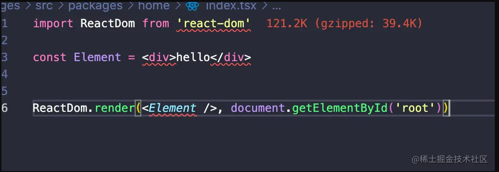

### 类型文件



引用第三方包在`TypeScript`文件时，会寻找**对应包的`package.json`中的`type`字段查找对应的类型定义文件**。

`react`和`react-dom`这两个包代码中都不存在对应的类型声明，所以需要单独安装对应的类型声明文件:

```shell
yarn add -D @types/react-dom @types/react
```

### `tsconfig.json` 别名配置

```json
// tsconfig.json
...
"baseUrl": "./",
/* Specify the base directory to resolve non-relative module names. */
"paths": {
  "@src/*": ["./src/*"],
  "@packages/*": ["./src/packages/*"],
  "@containers/*": ["./src/containers/*"],
}
```

如果要**配置`paths`那么一定是要配置`baseUrl`**，所谓`baseUrl`就是`paths`是相对于那个路径开始的

### interface 和 type 区别

#### 相同点

1. 一个对象或函数

```ts
interface User {
  name: string
  age: number
}

interface SetUser {
  (name: string, age: number): void;
}

// type
type SetUser = (name: string, age: number): void
```

2. 拓展(evtends) 与交叉类型(Intersection Types)
   - `interface` 可以 `extends`
   - type 是不允许 extends 和 implement 的
   - **但是 type 可以通过交叉类型 实现 interface 的 extend 行为**，并且两者并不是相互独立的，也就是说 interface 可以 extends type, type 也可以 与 interface 类型 交叉

```js
interface Name {
  name: string;
}

interface User extends Name {
  age: number;
}

// type 与 type 交叉
type Name = {
  name: string,
}
type User = Name & { age: number }

// interface extends type
type Name = {
  name: string,
}
interface User extends Name {
  age: nubmer;
}

// type 与 interface 交叉
interface Name {
  name: string;
}
type User = Name & {
  age: number,
}
```

#### 不同点

1. type 可以声明基本类型别名，联合类型，元组等类型, interface 不行

```ts
// 基本类型别名
type Name = string

// 联合类型
interface Dog {}
interface Cat {}
type Pet = Dog & Cat

// 具体定义数组的每个位置的类型
type PetList = [Dog, Pet]
```

2. type 语句可以使用 typeof 获取实例的类型进行赋值, inteface 不行

```ts
// 当你想获取一个变量的类型时，使用 typeof
let div = document.createElement("div")

type B = typeof div

type StringOrNumber = string | number
type Text = string | { text: string }
type NameLookup = Dictionary<string, Person>
type Callback<T> = (data: T) => void
type Pair<T> = [T, T]
type Coordinates = Pair<number>
type Tree<T> = T | { left: Tree<T>; right: Tree<T> }
```

3. interface 能够声明合并, type 不行

```ts
interface User {
  name: string
  age: number
}

interface User {
  sex: string
}

/*
User 接口为 {
  name: string
  age: number
  sex: string 
}
*/
```

### TS 内置类型工具

- never 表示一个不存在的类型
- never 与其他类型的联合后，是没有 never 的

```ts
// 将 T 所有属性编程可选的
type Partial<T> = {
  [K in keyof T]?: T[K]
}

// 将 T 所有属性变成只读的
type ReadOnly<T> = {
  readonly [K in keyof T]: T[K]
}

// 挑选一组属性组成新的类型
type Pick<T, K extends keyof T> = {
  [P in K]: T[P]
}

// 构造一个type，key为联合类型中的每个子类型，类型为T
// 值得注意的是keyof any得到的是string | number | symbol, 原因在于类型key的类型只能为string | number | symbol
type Record<K extends keyof any, T> = {
  [P in K]: T
}

// Exclude null and undefined from T
// 不能为null
type NonNullable<T> = T extends null | undefiend ? never : T

// 提取存在于 T, 但不存在于 U 的类型组成的联合类型
/**
 * 遍历T中的所有子类型，如果该子类型约束于U（存在于U、兼容于U），
 * 则返回never类型，否则返回该子类型
 */
type Exclude<T, U> = T extends U ? never : T
type Eg = Exclude<"key1" | "key2", "key2"> // key1


// Extract<T, U>提取联合类型T和联合类型U的所有交集
type Extract<T, U> = T extneds U ? T : never
type Eg = Extract<'key1' | 'key2', 'key1'> // 'key1'

// Omit<T, K>从类型T中剔除K中的所有属性
type Omit<T, K extends keyof any> = Pick<T, Exclude<keyof T, K>>
type Omit<T, K extends keyof any> = {
  [P in Exclude<keyof T, K>]: T[P]
}

// Parameters 获取函数的参数类型，将每个参数类型放在一个元组中
/**
 * Parameters首先约束参数T必须是个函数类型，所以(...args: any) => any>替换成Function也是可以的
 * 1. 具体实现就是，判断T是否是函数类型，如果是则使用inter P让ts推导出函数的参数类型，并将推导的结果存到类型P上，否则就返回never；
 * 2. infer关键词作用是让Ts推导类型，并将推导结果存储在其参数绑定的类型上
 * 3. infer关键词只能在extends条件类型上使用，不能在其他地方使用
 * 4. type Eg = [arg1: string, arg2: number]这是一个具名元组，多了语义化，而常见的元组是type tuple = [string, number]
 */
type Parameters<T extends (...args: any) => any> = T extends (...args: infer P) => any ? P : never;
/**
 * @example
 * type Eg = [arg1: string, arg2: number];
 */
type Eg = Parameters<(arg1: string, arg2: number) => void>;

// ReturnType 获取函数的返回值类型
/**
 * @desc ReturnType的实现其实和Parameters的基本一样
 * 无非是使用infer R的位置不一样。
 */
type ReturnType<T extends (...args: any) => any> = T extends (...args: any) => infer R ? R
```
